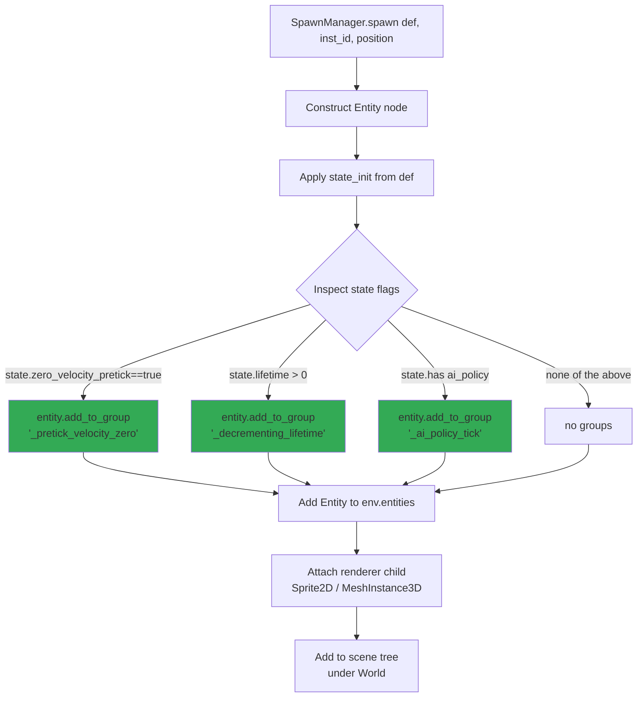
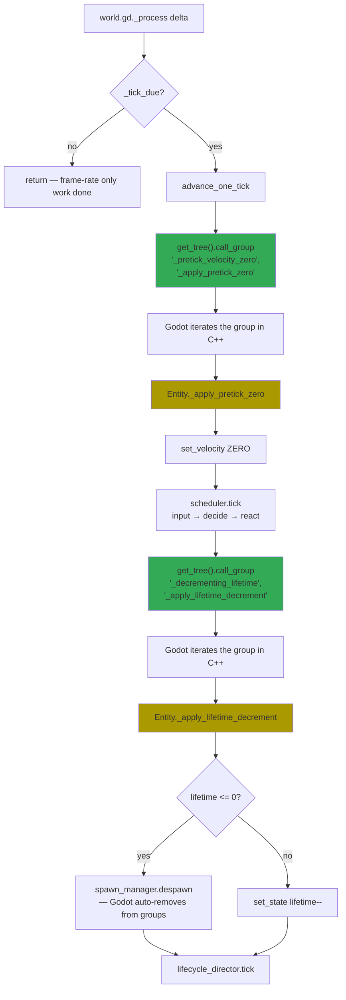
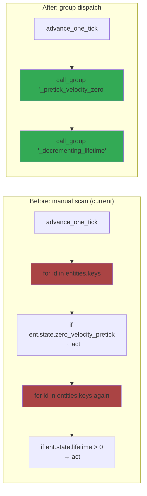

# Group dispatch — design notes

_Date: 2026-05-14_
_Status: proposal — not yet implemented_

Replace per-tick `for id in entities.keys()` scans in `world.gd` with
Godot's `add_to_group` / `call_group` mechanism. Co-locates per-entity
behavior on `Entity` while keeping timing centralized in the simulation.

## Spawn-time: enroll entity into groups based on state

The green nodes are the only new spawn-time work — three to five
`add_to_group` calls. Godot tracks group membership internally as
a list of node references per group name. Entities not opting in
pay zero ongoing cost.

## Per-tick: world.gd dispatches to groups

Green nodes are `call_group` dispatches — each is O(K) where K = the
number of entities in that group (typically 1–9, not 237). Orange
nodes are methods on `Entity` — per-entity logic co-located with the
data it touches.

## What this replaces

Each red box is **O(N) lookup-and-skip** — scan all entities, branch
on flag. At Aldenmere's 237 entities × 2 scans × 60 ticks/sec =
28,440 dict lookups/sec just to find the 1–9 that need work.

Each green box is **O(K) direct iteration** — Godot walks the group's
internal list, no flag checks. For K=5 at 60 ticks/sec = 300 calls/sec.
**~95× less work**, scales linearly with actual opt-in count rather
than total entity count.

## Lifecycle nuance — keeping groups synced with state

State that changes during runtime needs the group to stay synchronized.
Three strategies, depending on flag type:

| Flag type | Strategy |
|---|---|
| **Frozen at spawn** (`zero_velocity_pretick`, `has_ai_policy`) | Add at spawn; leave alone. No runtime resync needed. |
| **Counts down to despawn** (`lifetime`) | Add at spawn; `queue_free` auto-removes from groups when entity despawns. |
| **Toggled by rules at runtime** (rare — e.g. effect sets `disabled=true`) | Hook into `Entity.set_state` to sync, OR accept stale membership + the method checks the flag itself |

For Yume's two clearest targets (`zero_velocity_pretick`, `lifetime`),
strategies 1 and 2 cover everything. No `set_state` hook needed.

## Migration targets

| Current world.gd scan | Group name | Method on Entity |
|---|---|---|
| `_pretick_velocity_zero` | `_pretick_velocity_zero` | `_apply_pretick_zero()` |
| `_decrement_lifetimes` | `_decrementing_lifetime` | `_apply_lifetime_decrement()` |
| `actor_manager.tick_policies` | `_has_ai_policy` | `_tick_policy()` |
| `actor_manager.process_pending` | `_has_pending_action` | `_drain_pending()` |

First two are clearest wins (no phase-ordering risk, opt-in flags
already exist on state). The actor_manager scans are already over
a small managed list, not a full entity scan — defer those.

## Open questions before implementing

1. **Where does the spawn-time enrollment live?** `SpawnManager.spawn()`
   is the natural place (after `state_init` is applied, before scene-tree
   add). Each ADR that introduces a new opt-in flag adds one match arm.
   Alternative: `Entity._init` or `_ready` self-enrolls — less coupled,
   but spreads the "which groups exist" knowledge across N files.

2. **Should `set_state` re-sync group membership?** Probably not for the
   two targets above (frozen at spawn / counts down). Defer the hook
   until a real "toggled at runtime" case emerges.

3. **Are group names content-visible or engine-private?** Lean engine-
   private (underscore-prefixed) — content shouldn't query these groups,
   they're an engine implementation detail.

4. **How does this interact with `_engine` entity (ADR 0047)?** The
   `_engine` singleton has no state.zero_velocity_pretick and no
   lifetime > 0, so it's never enrolled in any of these groups. Safe.
