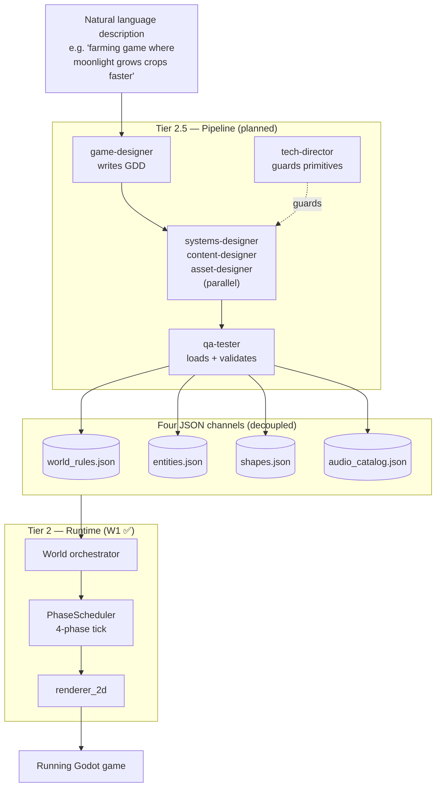
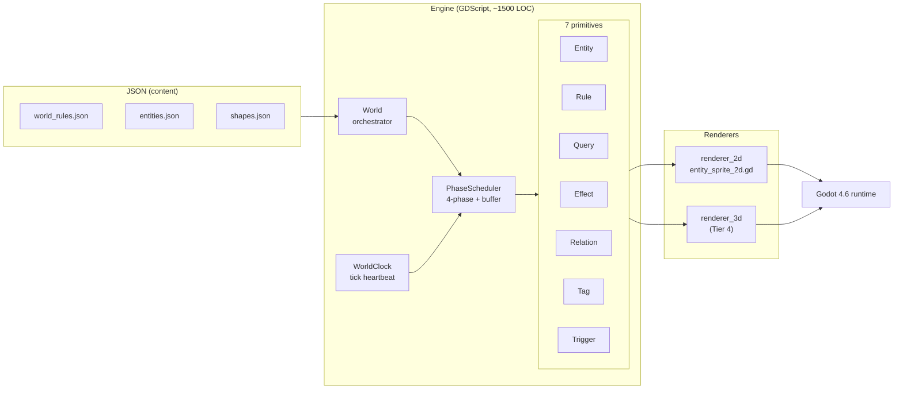
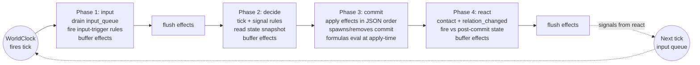
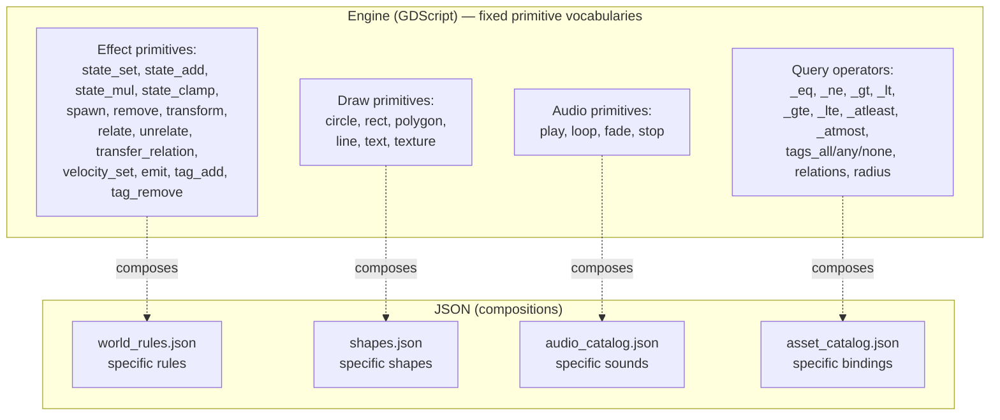
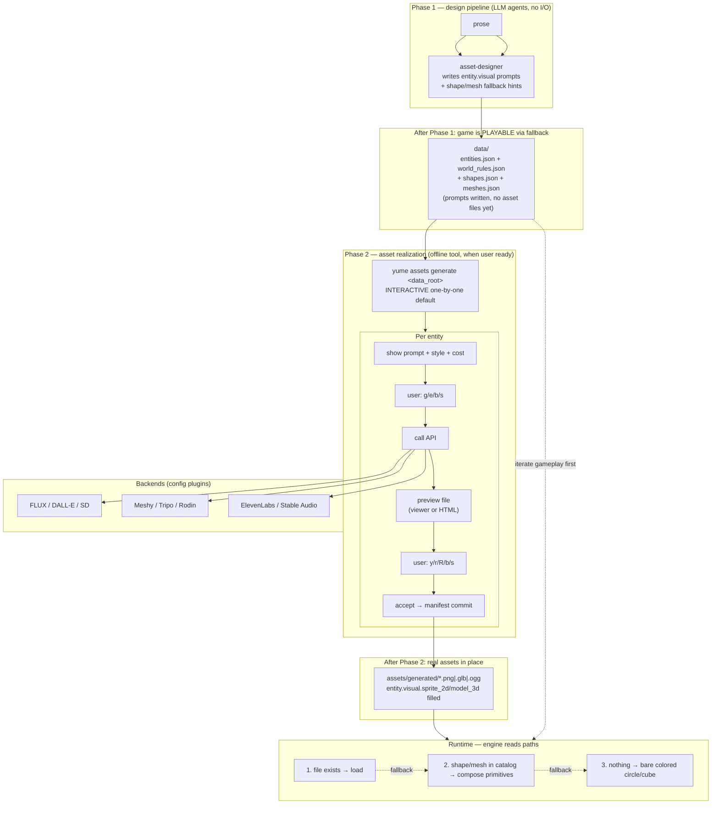

# How Yume Works — Visual Reference

Four mermaid diagrams that together explain Yume from the outside in:
pipeline → engine → tick loop → invariant #8.

---

## 1. Pipeline overview — prose to running game



Key idea: **prose flows down, JSON flows across, engine reads from the side**.
Six specialist agents produce four parallel JSON channels; the engine
consumes them. Swap any one channel without touching the others — go silent,
swap art style, replace rules — engine doesn't care.

---

## 2. Engine internals — primitives + interpreter



Key idea: **engine is small.** Eight files in `scripts/engine/`. The seven
primitives are typed GDScript classes; PhaseScheduler runs them. Renderer
sits on the side reading entity state per frame. Adding a 3D renderer
doesn't touch any primitive.

---

## 3. Four-phase tick — semantic identity



Key idea: **predictable causality.** Reads in `decide` see snapshot of prior
tick. Writes in `commit` apply in JSON definition order; later effects'
formulas read post-earlier-effect state. `react` runs after motion has
committed (so contact detection sees final positions). Signals emitted in
`react` cross to the *next* tick's input queue — no infinite cascade.

---

## 4. Invariant #8 — engine vs JSON, applied uniformly



Key idea: **engine knows verbs; JSON composes nouns.** Adding `damage` as
an effect type is forbidden — that's a noun, expressible as `state_add` on
`hp`. Adding `draw_tree` as an op is forbidden — that's a noun, expressible
as `circle` + `rect` in `shapes.json`. The same test applies to every
future layer Yume adds.

---

## 5. Bonus — what gets touched when you change one thing

```mermaid
flowchart TB
    Q["What if I want to..."]

    subgraph Q1["Change rules<br/>(e.g. crops grow faster)"]
        E1[edit world_rules.json] -.-> NoTouch1[engine untouched]
    end

    subgraph Q2["Swap art style<br/>(pixel → AI-gen 3D)"]
        E2a[swap entity.visual fields<br/>or asset_catalog.json] -.-> NoTouch2[engine + rules untouched]
    end

    subgraph Q3["Add a new genre<br/>(chess, shooter, ...)"]
        E3[new data folder<br/>entities + rules + assets] -.-> NoTouch3[engine + other games untouched]
    end

    subgraph Q4["Add a draw shape<br/>(bush, lantern)"]
        E4[append to shapes.json] -.-> NoTouch4[renderer code untouched]
    end

    subgraph Q5["Add a new primitive<br/>(animation in Tier 4)"]
        E5[engine GDScript edit<br/>+ new JSON channel] --> Touch5[engine touched once]
    end

    Q --> Q1
    Q --> Q2
    Q --> Q3
    Q --> Q4
    Q --> Q5
```



Key idea: **the engine is touched only when adding new vocabulary**, never
when adding new content. This is the test of correctness — if you're
editing engine code to add a new game, something's wrong.

---

## 6. Asset pipeline — two-phase + three-tier fallback



Key ideas:

- **Two phases, not in-line.** Phase 1 (design) writes JSON only. Phase 2
  (gen) is an explicit user-initiated step. Lets you iterate gameplay on
  fallback visuals before spending API credits.
- **Three-tier fallback** in the runtime renderer. Real asset → composite
  from `shapes.json`/`meshes.json` → bare primitive (colored circle/cube).
  **Always something visible** even with zero generated content.
- **Interactive one-by-one is the default** generation mode. Prompts are
  guesses — user verifies each. Batch mode is opt-in for CI / full
  re-runs after style change.
- **Backends are JSON plugins.** New API = config block + adapter (~50 LOC).
- **Engine never knows about prompts or APIs** — Phase 2 is offline
  tooling that fills paths into `entity.visual`. Engine reads file paths
  identical to human-drawn assets.

---

## How to view these

Mermaid renders in many places. Pick whichever fits:

| Tool | How |
|---|---|
| **GitHub** | Push this file, view on github.com — auto-renders |
| **VSCode** | Install extension *"Markdown Preview Mermaid Support"*, then `Ctrl+Shift+V` to preview |
| **Online** | Copy a single ` ```mermaid ... ``` ` block contents into [mermaid.live](https://mermaid.live) — instant render, exports SVG/PNG |
| **CLI** | `npm install -g @mermaid-js/mermaid-cli` then `mmdc -i this_file.md -o diagrams.png` |
| **Obsidian / Typora / Logseq** | All have built-in mermaid support |

For sharing single diagrams as images: [mermaid.live](https://mermaid.live)
is the fastest — paste, screenshot or export.

---

## How to extend

When adding a new architectural concept (e.g. Tier 3 actors with Plan +
Knowledge primitives), append a section here with a fresh diagram. Keep
each diagram focused on one idea — five focused diagrams beat one giant
one.
