# Yume — Full Architecture (2026-05-11)

_Snapshot diagram of every Yume layer + how content moves through
the system. Companion to `30_framework_primitives.md` (the contract)
and `32_architecture_diagrams.md` (older overviews)._

---

## 1. Whole system — five layers + feedback loop

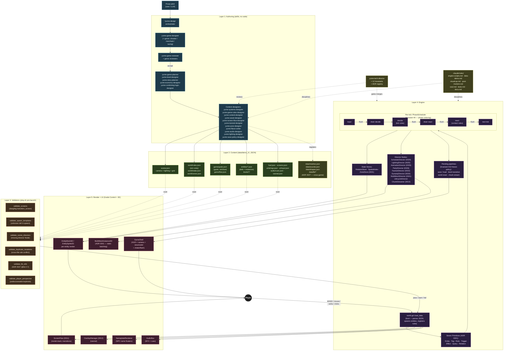

---

## 2. Engine subsystems — directors, stores, validators

```mermaid
flowchart LR
    subgraph EngineCore["Engine Core (scripts/engine/*.gd)"]
        World["world.gd<br/>(orchestrator)"]
        PS["phase_scheduler.gd<br/>(5-phase tick)"]
        QL["query.gd<br/>(QueryLib)"]
        EA["effect_apply.gd<br/>(70+ effect types)"]
        Form["formula.gd<br/>(Expression-based<br/>state.X / self.id /<br/>math helpers)"]
        World --> PS
        PS --> QL
        PS --> EA
        EA --> Form
        QL --> Form
    end

    subgraph Stores["Data Stores"]
        RS["RelationStore<br/>(typed edges)"]
        SI["SpatialIndex<br/>(radius queries)"]
        ZS["ZoneStore<br/>(ADR 0031)"]
    end
    EngineCore --> Stores

    subgraph Directors["Director Nodes (sibling of World in .tscn)"]
        SD["ScheduleDirector (0029)<br/>NPC daily routines"]
        LD["LightingDirector (0025)<br/>day-night + seasonal"]
        AD["AnimationDirector (0035)<br/>per-piece limb tracks"]
        PD["PartyDirector (0026)<br/>leash followers"]
        FD["FactionDirector (0032)<br/>politics + war"]
        DD["DynastyDirector (0034)<br/>lineage + heirs"]
        MMD["MultiMeshDirector (0041)<br/>static-decoration batching"]
        LCD["LifecycleDirector<br/>aging + stages (0036)"]
        CS["ChunkStreamer (0014)<br/>infinite worlds"]
    end
    EngineCore --> Directors

    subgraph Renderers["Renderers + UI"]
        EM3["EntityMesh3D / 2D<br/>per-entity"]
        GS["GameShell<br/>HUD + camera"]
        SF["ScreenFlow (0011)"]
        OM["OverlayManager (0012)"]
        SM["SettingsManager (0013)"]
        SS["SaveState (0010)"]
        NR["NameplateRenderer"]
        AB["AudioBus"]
        LR["LightingDirector glue"]
    end
    Directors --> Renderers
    Stores --> Renderers

    subgraph Validators["Validators (tools/, sync-time)"]
        V1["validate_screens.py"]
        V2["validate_spawn_templates.py"]
        V3["validate_scene_directors.py<br/>(NEW 2026-05-11)"]
        V4["validate_duplicate_mutations.py<br/>(NEW 2026-05-11)"]
        V5["validate_lib_refs.py"]
        V6["validate_player_perspective.py"]
        V7["validate_schedule.py"]
    end

    Tools["scripts/play.sh<br/>pre-launch gate"]
    Tools --> Validators
```

---

## 3. Skill pipeline — prose to running game

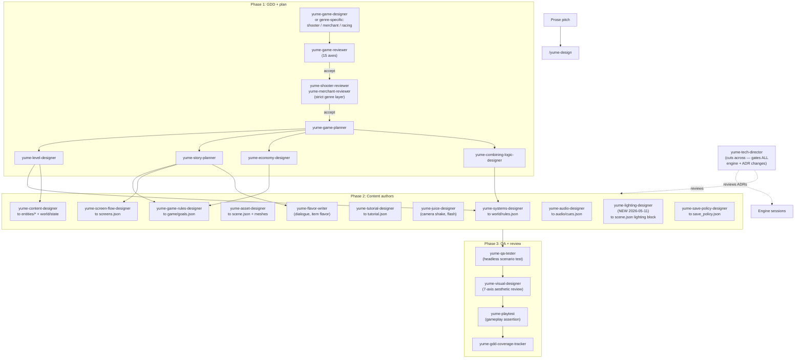

---

## 4. Per-tick state flow

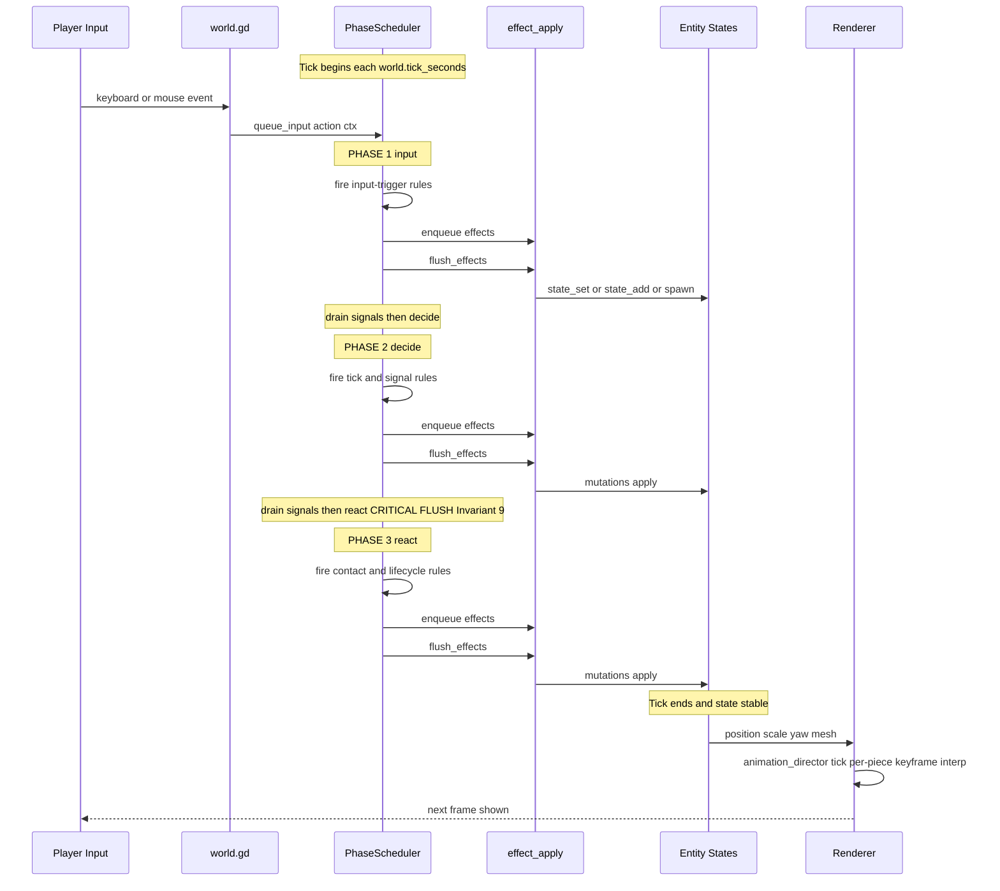

---

## 5. Invariants cheat-sheet

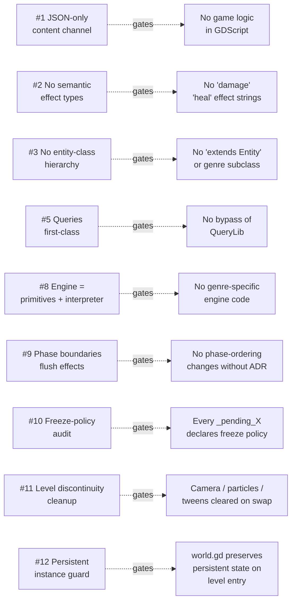

---

## 6. Engine modules — which `.gd` reads which `.json`

This is the **boot-time data flow**: every JSON file is parsed by exactly
one `.gd` module which exposes the parsed data to the rest of the engine
via in-memory structures (`env` dict, manager instances, registries).
`world.gd::load_data` orchestrates the order; downstream consumers
receive references, never re-parse.

```mermaid
flowchart LR
    %% =========================================================
    %% PER-GAME JSON files (data/demo_X/)
    %% =========================================================
    subgraph GameData["Per-game JSON (data/demo_X/)"]
        direction TB
        sceneJ["scene.json"]:::json
        physJ["world/rules.json"]:::json
        ruleJ["game/goals.json"]:::json
        flowJ["game/flow.json"]:::json
        stateJ["world/state.json"]:::json
        zoneJ["world/zones.json"]:::json
        worldJ["world.json<br/>(chunked games)"]:::json
        entsJ["entities/*.json<br/>levels/*/entities.json"]:::json
        hudJ["hud.json"]:::json
        screensJ["screens.json"]:::json
        inputJ["ui/input.json"]:::json
        stringsJ["ui/strings.json"]:::json
        cuesJ["audio/cues.json"]:::json
        tutJ["tutorial.json"]:::json
        saveJ["save_policy.json"]:::json
        settingsJ["settings_schema.json"]:::json
        factJ["factions.json"]:::json
        techJ["tech_trees.json"]:::json
        testJ["tests.json"]:::json
        macJ["macros.json"]:::json
        actorJ["actors.json"]:::json
    end

    %% =========================================================
    %% SHARED JSON (data/, cross-game)
    %% =========================================================
    subgraph SharedData["Shared JSON (data/, cross-game)"]
        direction TB
        meshJ["meshes.json"]:::shared
        shapeJ["shapes.json"]:::shared
        soundJ["sounds.json"]:::shared
        libJ["lib/manifest.json<br/>lib/*.json"]:::shared
    end

    %% =========================================================
    %% ENGINE MODULES (scripts/engine/*.gd)
    %% =========================================================
    World["world.gd<br/>orchestrator<br/>opens FileAccess<br/>JSON.parse_string"]:::core
    Rule["rule.gd<br/>Rule.from_dict"]:::core
    Macro["macro_expander.gd"]:::core
    LibRes["lib_resolver.gd"]:::core
    Sched["phase_scheduler.gd"]:::core
    EffApply["effect_apply.gd<br/>+ formula.gd"]:::core
    Query["query.gd"]:::core

    InputReg["input_registrar.gd"]:::module
    ScreenF["screen_flow.gd"]:::module
    Overlay["overlay.gd"]:::module
    GShell["game_shell.gd"]:::module
    AudioB["audio_bus.gd"]:::module
    SaveS["save_state.gd"]:::module
    Settings["settings_manager.gd"]:::module
    Scenario["scenario_runner.gd"]:::module
    Capture["capture_runner.gd"]:::module

    MeshLib["mesh_lib.gd"]:::module
    ShapeLib["shape_lib.gd"]:::module

    SchedD["schedule_director.gd<br/>reads entity def<br/>schedule blocks"]:::director
    LightD["lighting_director.gd"]:::director
    FactD["faction_director.gd"]:::director
    TechT["tech_tree.gd"]:::director
    DynD["dynasty_director.gd<br/>reads entity def<br/>lineage_id"]:::director
    LifeD["lifecycle_director.gd<br/>reads entity def<br/>age_stages"]:::director
    PartyD["party_director.gd<br/>reads entity tag<br/>party_member"]:::director
    MMD["multimesh_director.gd<br/>reads mesh def<br/>multimesh_eligible"]:::director
    AnimD["animation_director.gd<br/>reads mesh def<br/>animations"]:::director
    Chunk["chunk_streamer.gd"]:::director
    ZoneS["zone_store.gd"]:::store

    %% =========================================================
    %% PARSE EDGES — green = JSON loaded by this .gd
    %% =========================================================
    sceneJ --> World
    physJ  --> World
    ruleJ  --> World
    flowJ  --> World
    stateJ --> World
    zoneJ  --> World
    worldJ --> World
    entsJ  --> World
    tutJ   --> World
    macJ   --> Macro
    actorJ --> World

    libJ      --> LibRes
    LibRes -.-> World
    Macro  -.-> World

    inputJ    --> InputReg
    screensJ  --> ScreenF
    stringsJ  --> ScreenF
    hudJ      --> GShell
    cuesJ     --> AudioB
    soundJ    --> AudioB
    meshJ     --> MeshLib
    shapeJ    --> ShapeLib
    saveJ     --> SaveS
    settingsJ --> Settings
    factJ     --> FactD
    techJ     --> TechT
    testJ     --> Scenario

    %% =========================================================
    %% IN-MEMORY HANDOFFS — blue = .gd hands data to consumer
    %% =========================================================
    World --> Sched
    Sched --> Query
    Sched --> EffApply
    World --> SchedD
    World --> LightD
    World --> FactD
    World --> DynD
    World --> LifeD
    World --> PartyD
    World --> MMD
    World --> AnimD
    World --> Chunk
    World --> ZoneS
    MeshLib -.-> MMD
    MeshLib -.-> AnimD
    ShapeLib -.-> GShell
    AudioB -.-> EffApply
    Settings -.-> World
    SaveS -.->|read/write<br/>user://| World

    classDef json fill:#2a3f1e,stroke:#9ac962,color:#e8f8d8
    classDef shared fill:#3a3f1e,stroke:#c9b962,color:#f8f4d8
    classDef core fill:#2a1e3f,stroke:#a062c9,color:#f0e0ff,font-weight:bold
    classDef module fill:#1e2e3f,stroke:#62a3c9,color:#e0f0ff
    classDef director fill:#3f1e3a,stroke:#c962b3,color:#ffe0f0
    classDef store fill:#3f2e1e,stroke:#c98762,color:#f8e8d8
```

### Reading the diagram

- **Green nodes** are JSON files (per-game = mid-green, shared = olive).
- **Purple nodes** are the four core engine modules — `world.gd` is the
  only one that opens FileAccess and parses JSON for the simulation
  layer. Everything else receives in-memory structures.
- **Blue nodes** are subsystems that parse THEIR own JSON file
  (input_registrar reads ui/input.json, screen_flow reads screens.json,
  etc.) but never the simulation files.
- **Pink nodes** are Director Nodes — they don't parse their own JSON;
  they read fields off entity defs that `world.gd` already parsed
  (e.g., `ScheduleDirector` walks `entity.def.schedule` blocks;
  `MultiMeshDirector` reads `meshes.json#<def>.multimesh_eligible`
  via MeshLib).

### Boot order (`world.gd::load_data`)

1. `lib_resolver` loads `data/lib/manifest.json` + `lib/*.json` (cross-game vocabulary)
2. `input_registrar` reads `ui/input.json` + registers Godot InputMap
3. `macro_expander` loads `macros.json` (if present)
4. `scene.json` parsed → camera mode, tick_seconds, lighting block, position_scale, level_seed
5. **If `game/flow.json` exists** (multi-level):
   - Load `world/rules.json` (sim rules)
   - Load `game/goals.json` (game rules)
   - Load `tutorial.json` (overlay rules)
   - Load `world/state.json` → `env.world_state`
   - Load `entities/*.json` (persistent defs)
   - Load first level's `levels/<n>/entities.json` + `rules.json`
6. **Else** (flat layout): same files at root level
7. `world/zones.json` → `ZoneStore` (ADR 0031)
8. `world.json` (chunked games — ADR 0014) → `ChunkStreamer`
9. `factions.json` → `FactionDirector` (ADR 0032)
10. `tech_trees.json` → `TechTree` (ADR 0033)
11. `save_policy.json` → `SaveState` (ADR 0010)
12. `settings_schema.json` → `SettingsManager` (ADR 0013)
13. Director Nodes initialized (each receives env dict reference)
14. `MultiMeshDirector.scan_and_batch()` (ADR 0041) — promotes static decoration
15. `screens.json` + `hud.json` + `cues.json` lazy-loaded by GameShell/ScreenFlow when scene tree is ready

### Key invariant — single-parse discipline

Every JSON file has exactly ONE parser. Downstream code receives the
parsed dict/array reference. No double-parsing, no re-reading from
disk during the tick loop. This is enforced by:

- `world.gd` owns simulation JSON (physics / rules / state / entities / flow / tutorial)
- Each manager / director owns ITS JSON (audio_bus → cues.json, screen_flow → screens.json, etc.)
- `mesh_lib` + `shape_lib` are global libraries — loaded once per session, queried by id

If a future feature needs to "re-read scene.json mid-game," the right
answer is to push the change into `env.world_state` or a manager
instance and re-broadcast, not to FileAccess a second time.

---

## 7. Per-module deep-dive — input JSON → action → tick role

Section 6 showed *which* `.gd` parses *which* `.json`. This section
expands each major module: **what it builds in memory, what runtime
API it exposes, what it does each tick**.

### 7.1 The 4 simulation cores (`world` + `rule` + `phase_scheduler` + `effect_apply` + `query` + `formula`)

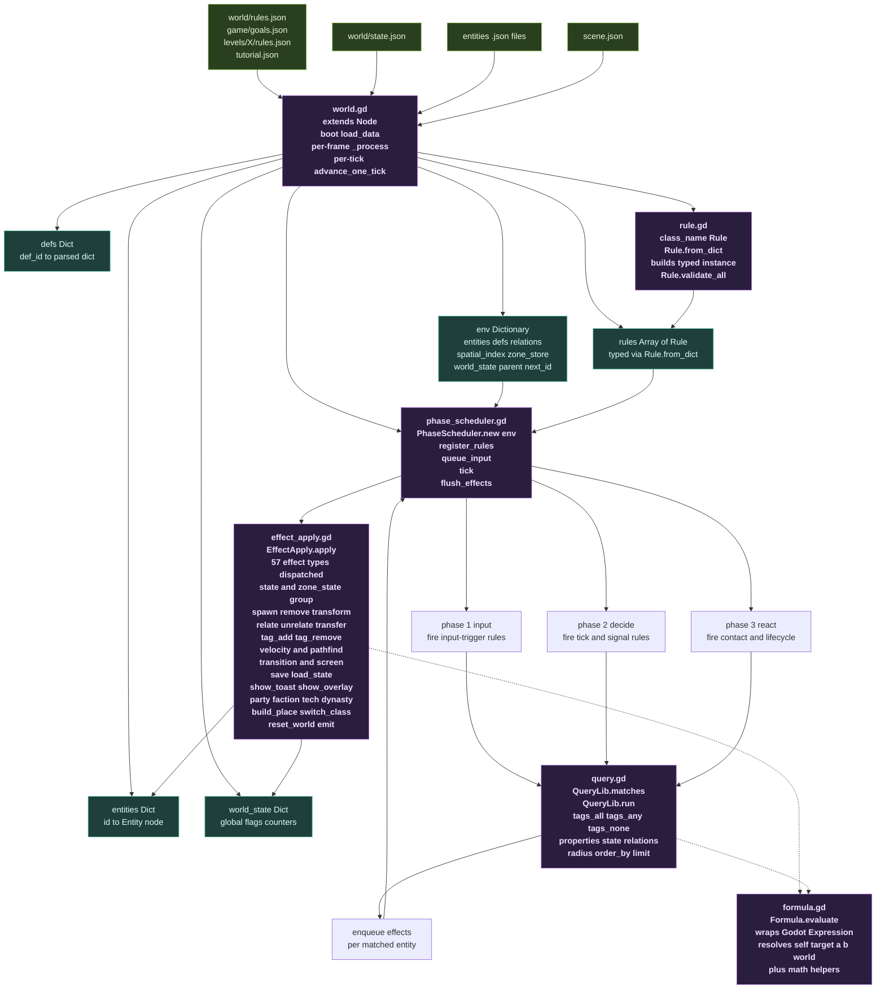

### 7.2 What each core module ACTUALLY does

**world.gd** — the boot orchestrator + tick driver:

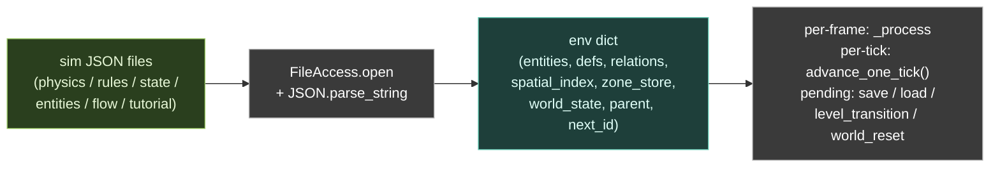

**rule.gd** — pure typed-data class:

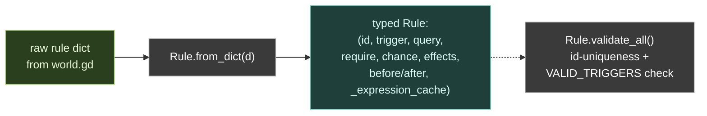

Valid triggers: `tick · contact · signal · input · spawn · despawn · relation_changed · scheduled`.

**phase_scheduler.gd** — the 5-phase tick engine:

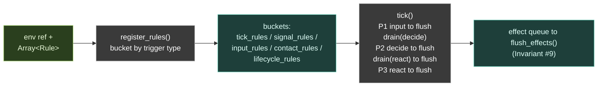

**query.gd** — declarative entity matcher (stateless):

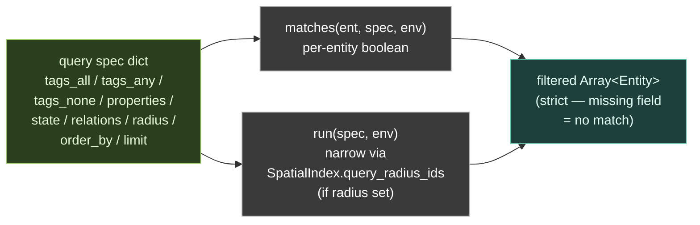

**effect_apply.gd** — the 57-effect dispatcher (stateless):

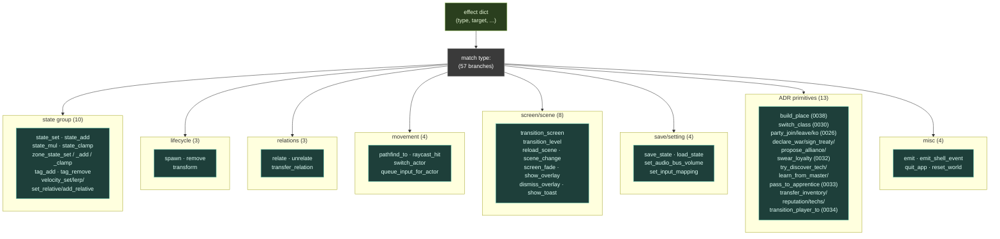

**formula.gd** — string-to-value expression evaluator (stateless):

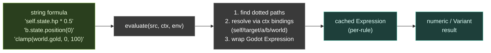

### 7.3 Director Nodes — what they do with parsed data

Directors are sibling Nodes of `World` in the per-game `.tscn`. They don't
parse their own JSON for sim data — they **read fields off the entity defs
that world.gd already parsed**, and tick alongside the scheduler.

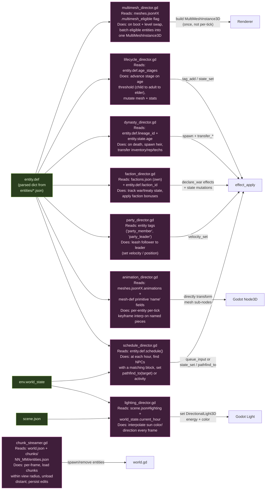

### 7.4 UI / shell modules — what they do with parsed data

These modules parse their OWN JSON and never touch the simulation
files. They live alongside World (siblings in the scene tree).

**Boot-time pre-pass parsers** (run BEFORE rules get parsed):

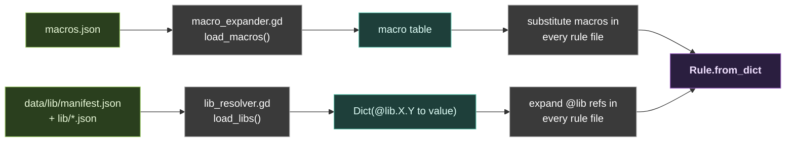

**Input + screen / overlay** (driven by player + transition_* effects):

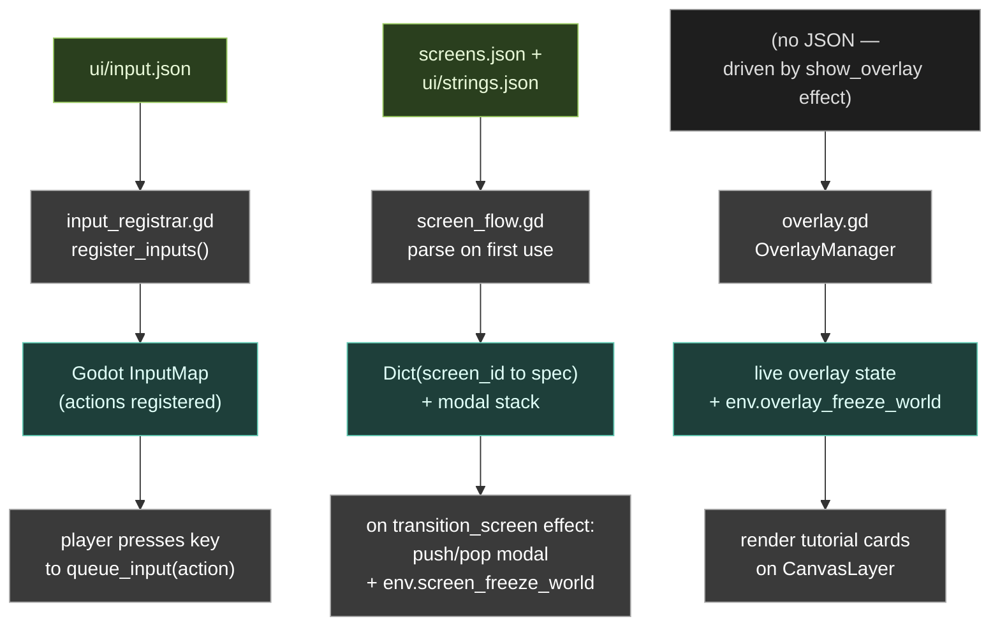

**HUD / camera + audio + persistence**:

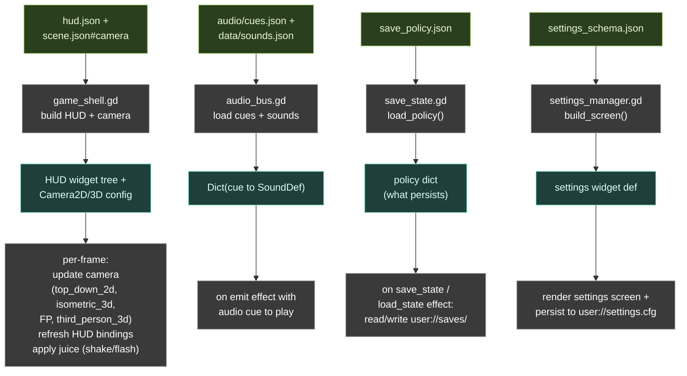

**Asset libraries + per-entity rendering**:

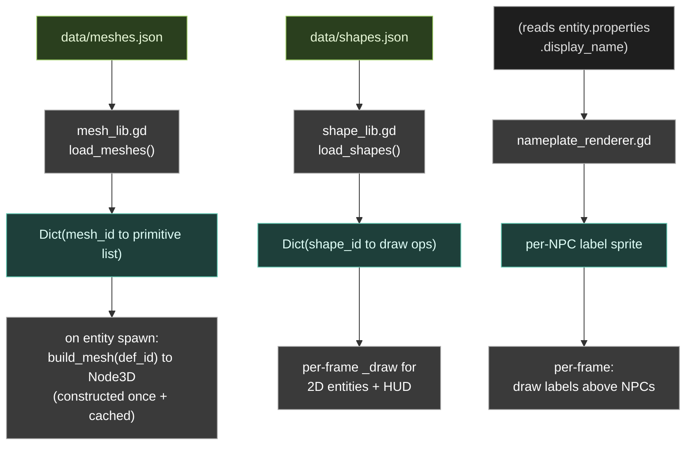

### 7.5 The full per-tick call chain (concrete trace)

For one rule like `wolf_pursue_villager` (contact-pair, found by Aldenmere QA):

```mermaid
sequenceDiagram
    participant Tree as Godot scene tree
    participant W as world.gd
    participant Sched as phase_scheduler.gd
    participant Q as query.gd
    participant E as effect_apply.gd
    participant SX as spatial_index.gd
    participant Ent as Entity

    Tree->>W: _process delta
    W->>W: advance_one_tick
    W->>Sched: tick

    Note over Sched: PHASE 3 react (contact rules)
    Sched->>Q: run wolf spec (tags_all wolf)
    Q->>SX: query_radius_ids full
    SX-->>Q: wolf id list
    Q-->>Sched: matched wolves

    loop per wolf
        Sched->>Q: run villager spec radius 40
        Q->>SX: query_radius_ids at wolf pos
        SX-->>Q: candidate villager ids
        Q-->>Sched: matched villagers
        Sched->>Sched: enqueue pathfind_to effect
    end

    Sched->>Sched: flush_effects
    loop per queued effect
        Sched->>E: apply effect env ctx
        E->>E: dispatch pathfind_to
        E->>Ent: set velocity or queue path
    end

    Note over Sched: tick complete; renderer reads state next frame
```

---

## 8. Entities — the only "noun" in the engine

Yume has **one** runtime type for everything that exists in the world.
A wolf, a tree, a player, a fire pit, a HUD-invisible "world_clock"
singleton — they're all `Entity` (extends plain `Node`, never `Node2D`
or `Node3D`). Distinctions emerge from **tags + properties + state**,
never from class hierarchy (Invariant #3).

### 8.1 Anatomy — what an entity JSON looks like vs what it becomes in memory

```mermaid
flowchart LR
    subgraph JSON["entities/wolf.json (def)"]
        direction TB
        J1["id: 'wolf_3d'"]:::field
        J2["tags: (animal, predator,<br/>blocks_motion)"]:::field
        J3["properties:<br/>(aabb_extents: (0.4, 0.4, 0.6),<br/>display_name: 'Wolf')"]:::field
        J4["state_init:<br/>(hp: 30, max_speed: 4,<br/>velocity: (0,0), yaw: 0,<br/>position: (0,0,0))"]:::field
        J5["visual:<br/>(mesh_3d: 'wolf_3d',<br/>tint: '#806040')"]:::field
    end

    subgraph INST["levels/X/entities.json (instance)"]
        direction TB
        I1["def: 'wolf_3d'"]:::inst
        I2["id: 'wolf_alpha'"]:::inst
        I3["position: (40, 0, 30)"]:::inst
        I4["state: (hp: 50)<br/>(override)"]:::inst
    end

    Create["Entity.create(def, inst_id,<br/>overrides)"]:::action

    JSON --> Create
    INST --> Create

    subgraph MEM["Entity Node (in-memory)"]
        direction TB
        M1["def_id: 'wolf_3d'<br/>instance_id: 'wolf_alpha'"]:::out
        M2["tags: Array&lt;String&gt;<br/>(animal, predator,<br/>blocks_motion)"]:::out
        M3["properties: Dict<br/>(aabb_extents, display_name)<br/>(STATIC — rules can't mutate)"]:::out
        M4["state: Dict<br/>(hp: 50, max_speed: 4,<br/>velocity: Vector3,<br/>yaw: 0,<br/>position: Vector3(40,0,30))<br/>(DYNAMIC — rules mutate)"]:::out
        M5["visual: Dict<br/>(renderer reads this;<br/>engine ignores)"]:::out
    end

    Create --> MEM

    classDef field fill:#2a3f1e,stroke:#9ac962,color:#e8f8d8
    classDef inst fill:#3a3f1e,stroke:#c9b962,color:#f8f4d8
    classDef action fill:#3a3a3a,stroke:#aaa,color:#fff
    classDef out fill:#1e3f3a,stroke:#62c9b3,color:#e0fff8
```

The DEF describes the *kind* (parsed once into `env.defs`). The
INSTANCE references the def by name + overrides only what differs.
`Entity.create(def, inst_id, overrides)` merges them into a single
runtime Node. Both `position` and `velocity` get normalized from
JSON arrays to `Vector2` / `Vector3` so motion math doesn't break.

### 8.2 Reserved state fields — engine reads these, content names the rest

```mermaid
flowchart TB
    subgraph Reserved["Reserved fields (engine-recognized)"]
        direction LR
        R1["position<br/>Vector2/3"]:::res
        R2["velocity<br/>Vector2/3<br/>(motion integrator<br/>adds to position)"]:::res
        R3["yaw<br/>float radians<br/>(renderers apply<br/>Y-rotation)"]:::res
        R4["age<br/>in-game years<br/>(LifecycleDirector)"]:::res
        R5["life_stage<br/>infant/child/<br/>adult/elder/dead"]:::res
        R6["class_progress<br/>(ADR 0030)"]:::res
        R7["known_techs<br/>(ADR 0033)"]:::res
        R8["dynasty_id<br/>(ADR 0034)"]:::res
    end

    subgraph Content["Content-named (engine doesn't know these)"]
        direction LR
        C1["hp / hunger / mana<br/>thirst / warmth"]:::content
        C2["gold / score / xp<br/>reputation_tier"]:::content
        C3["facing / drag<br/>zero_velocity_pretick<br/>max_speed"]:::content
        C4["held_item / held_cooked<br/>quest_stage"]:::content
        C5["any other field<br/>your rules need"]:::content
    end

    Rules["Rules query + mutate<br/>both groups identically<br/>via state_set / state_add /<br/>state_mul / state_clamp"]:::action

    Reserved --> Rules
    Content --> Rules

    classDef res fill:#3f1e2e,stroke:#c96287,color:#ffe0e8
    classDef content fill:#1e3f3a,stroke:#62c9b3,color:#e0fff8
    classDef action fill:#3a3a3a,stroke:#aaa,color:#fff
```

The engine cares about position / velocity / yaw / age for physics +
director ticks. Everything else (hp, hunger, gold, score) is JUST a
named slot in `state` dict that rules read + mutate. The engine never
checks "is this an hp field?" — it just looks up `state[field_name]`.

### 8.3 Entity lifecycle — boot, spawn, persist, despawn

```mermaid
flowchart TB
    Boot["world.gd boot:<br/>load_entities_file()"]:::action
    DefMap["env.defs(def_id)<br/>= parsed def dict"]:::store
    Initial["initial_instances<br/>+ patterns"]:::data
    Spawn1["Entity.create(def, id)<br/>+ instance overrides"]:::action
    EntMap["env.entities(id)<br/>= Entity Node"]:::store
    SpatIdx["spatial_index<br/>.insert(id, pos)"]:::store

    Boot --> DefMap
    Boot --> Initial
    Initial --> Spawn1
    DefMap --> Spawn1
    Spawn1 --> EntMap
    Spawn1 --> SpatIdx

    %% Runtime spawn
    SpawnE["spawn effect<br/>fires from rule"]:::action
    SpawnE -.->|same path| Spawn1

    %% Removal
    RemE["remove effect<br/>(or transform = remove+spawn)"]:::action
    RemE --> EntMap
    RemE --> SpatIdx
    RemE -.->|despawn trigger fires<br/>BEFORE removal| Rules["rules listening on<br/>type: despawn"]:::data

    %% Persistent guard
    Transit["transition_level<br/>fires"]:::action
    Transit --> CheckP{"is entity tagged<br/>'persistent'?"}
    CheckP -->|yes| Skip["SKIP overwrite<br/>(Invariant #12)<br/>but apply position<br/>teleport if level<br/>declares one"]:::out
    CheckP -->|no| Remove["destroy + respawn<br/>from new level's<br/>entities.json"]:::out

    classDef action fill:#3a3a3a,stroke:#aaa,color:#fff
    classDef store fill:#1e3f3a,stroke:#62c9b3,color:#e0fff8
    classDef data fill:#2a3f1e,stroke:#9ac962,color:#e8f8d8
    classDef out fill:#3f1e2e,stroke:#c96287,color:#ffe0e8
```

Key points:
- **Defs are parsed once** at boot into `env.defs`. Multiple entities
  reuse the same def — instances only store overrides.
- **Patterns** (ring / grid / scatter / cluster / mirror / line) in
  `entities.json#patterns` expand at boot into N instances. See
  `instance_patterns.gd`.
- **Runtime spawn** (a `spawn` effect from a rule) uses the SAME
  factory path — there's no two-tier code path for "boot entity" vs
  "runtime entity."
- **Persistent guard** (Invariant #12) — entities tagged `persistent`
  survive `transition_level`. The NEW level's instance with same id
  is SKIPPED for state but its `position` is applied as a teleport.
  This is how `world_clock` (singleton holding world_state) keeps
  its progression across levels.

### 8.4 How rules find + mutate entities

```mermaid
flowchart LR
    Rule["rule fires<br/>(trigger matched)"]:::action
    Q["query.gd::run(spec, env)"]:::core
    Filter["filter by:<br/>tags_all / tags_any / tags_none<br/>properties.X_op<br/>state.X_op<br/>relations<br/>radius (uses SpatialIndex)<br/>order_by / limit"]:::action
    Matched["matched: Array&lt;Entity&gt;"]:::out

    Rule --> Q --> Filter --> Matched

    Matched -->|"context: {self: ent}<br/>(or {a: x, b: y} for<br/>contact-pair)"| Effects["effect queue<br/>(per matched entity)"]:::out

    Effects -->|"flush at phase boundary"| Apply["effect_apply.gd<br/>resolve target to Entity<br/>mutate state / spawn / remove /<br/>tag_add / relate / etc."]:::core

    Apply -.->|"state_set with formula"| Formula["formula.gd<br/>self.state.X<br/>target.state.Y<br/>b.position(0)<br/>world.gold"]:::core

    classDef action fill:#3a3a3a,stroke:#aaa,color:#fff
    classDef core fill:#2a1e3f,stroke:#a062c9,color:#f0e0ff,font-weight:bold
    classDef out fill:#1e3f3a,stroke:#62c9b3,color:#e0fff8
```

---

## 9. world/rules.json vs game/goals.json — the conceptual split (ADR 0009)

Both files are parsed by `world.gd::_load_rules_file` into the SAME
typed `Rule` objects, registered with the SAME `PhaseScheduler`. The
engine doesn't care which file a rule came from. **The split is for
HUMANS** — different skills own different files; different concerns
live in different places.

### 9.1 The decision tree

```mermaid
flowchart TB
    Q["I want to add a rule.<br/>Which file?"]:::action

    Q --> Q1{"Is this a TRUTH<br/>of the world<br/>(would exist even<br/>without a game)?"}
    Q1 -->|yes| Phys["world/rules.json"]:::phys
    Q1 -->|no| Q2{"Is this a GOAL<br/>imposed by the<br/>player's game?<br/>(score, win, lose,<br/>level progression)"}
    Q2 -->|yes| Game["game/goals.json"]:::game
    Q2 -->|no| Q3{"Is this a tutorial<br/>or overlay-driven hint?"}
    Q3 -->|yes| Tut["tutorial.json"]:::tut
    Q3 -->|no| Lvl["levels/&lt;N&gt;/rules.json<br/>(only fires when<br/>that level is loaded)"]:::lvl

    classDef action fill:#3a3a3a,stroke:#aaa,color:#fff
    classDef phys fill:#1e2e3f,stroke:#62a3c9,color:#e0f0ff
    classDef game fill:#3f2e1e,stroke:#c98762,color:#f8e8d8
    classDef tut fill:#3f1e3a,stroke:#c962b3,color:#ffe0f0
    classDef lvl fill:#2a3f1e,stroke:#9ac962,color:#e8f8d8
```

### 9.2 What lives in each file — example rules

```mermaid
flowchart TB
    subgraph Physics["world/rules.json — SIMULATION"]
        direction TB
        P1["hunger_decay<br/>(every tick, hunger -= 0.05)"]:::phys
        P2["wolf_pursue_villager<br/>(contact-pair AI)"]:::phys
        P3["fire_warmth_aura<br/>(spread heat in radius)"]:::phys
        P4["plant_grow<br/>(growth += 1 if wet)"]:::phys
        P5["day_rollover<br/>(hour ≥ 24 to day++, hour = 0)"]:::phys
        P6["motion_drag<br/>(velocity *= 0.95)"]:::phys
    end

    subgraph Game["game/goals.json — GOALS"]
        direction TB
        G1["score_on_kill<br/>(state_add world.score, 1)"]:::game
        G2["win_at_score_30<br/>(if world.score &gt;= 30,<br/>transition_screen 'win')"]:::game
        G3["lose_at_hp_0<br/>(if player.hp ≤ 0,<br/>transition_screen 'lose')"]:::game
        G4["transition_to_next_level<br/>(on contact, transition_level)"]:::game
        G5["sale_complete_juice<br/>(on signal 'sale_clinch':<br/>shake + flash + toast)"]:::game
        G6["day_30_win<br/>(if world.day &gt;= 30 AND<br/>50% villagers alive,<br/>show win screen)"]:::game
    end

    subgraph Tutorial["tutorial.json — onboarding"]
        direction TB
        T1["show_overlay_movement_<br/>tip_first_tick"]:::tut
        T2["dismiss_overlay_on_first_<br/>move"]:::tut
    end

    subgraph Level["levels/L1/rules.json — per-level"]
        direction TB
        L1["spawn_boss_at_30s<br/>(only fires in this level)"]:::lvl
        L2["camera_intro_pan<br/>(once on level enter)"]:::lvl
    end

    Owner["Owner skill:"]:::action
    Owner --> Physics
    PhySys["yume-systems-designer"]:::skill --> Physics
    Game --> GameSys["yume-game-rules-designer"]:::skill
    Tutorial --> TutSys["yume-tutorial-designer"]:::skill
    Level --> AnySys["any (level-scoped)"]:::skill

    classDef phys fill:#1e2e3f,stroke:#62a3c9,color:#e0f0ff
    classDef game fill:#3f2e1e,stroke:#c98762,color:#f8e8d8
    classDef tut fill:#3f1e3a,stroke:#c962b3,color:#ffe0f0
    classDef lvl fill:#2a3f1e,stroke:#9ac962,color:#e8f8d8
    classDef action fill:#3a3a3a,stroke:#aaa,color:#fff
    classDef skill fill:#1e3a4a,stroke:#5fb3d9,color:#e8f4f8
```

### 9.3 What happens at boot — both files merge into one rule list

```mermaid
flowchart LR
    F1["world/rules.json"]:::phys
    F2["game/goals.json"]:::game
    F3["tutorial.json<br/>(optional)"]:::tut
    F4["levels/L1/rules.json"]:::lvl

    World["world.gd<br/>_load_rules_file()<br/>(× 4 times)"]:::core

    F1 --> World
    F2 --> World
    F3 --> World
    F4 --> World

    Merged["one Array&lt;Rule&gt;<br/>(typed via<br/>Rule.from_dict)"]:::out

    World --> Merged

    Sched["PhaseScheduler.register_rules()<br/>(buckets by trigger type)"]:::core
    Merged --> Sched

    Sched -.->|"NO distinction —<br/>same buckets, same<br/>phase ordering"| AllFire["all rules fire<br/>uniformly per tick"]:::out

    classDef phys fill:#1e2e3f,stroke:#62a3c9,color:#e0f0ff
    classDef game fill:#3f2e1e,stroke:#c98762,color:#f8e8d8
    classDef tut fill:#3f1e3a,stroke:#c962b3,color:#ffe0f0
    classDef lvl fill:#2a3f1e,stroke:#9ac962,color:#e8f8d8
    classDef core fill:#2a1e3f,stroke:#a062c9,color:#f0e0ff,font-weight:bold
    classDef out fill:#1e3f3a,stroke:#62c9b3,color:#e0fff8
```

### 9.4 Why the split matters — reuse + ownership

```mermaid
flowchart LR
    subgraph Sim["world/rules.json<br/>(the simulation)"]
        S1["doomarena3d/<br/>rules.json"]:::phys
    end

    subgraph Games["game/goals.json variants<br/>(same world, different games)"]
        G1["deathmatch/<br/>game/goals.json<br/>(win: 25 kills)"]:::game
        G2["score-attack/<br/>game/goals.json<br/>(win: 60s timer)"]:::game
        G3["capture-flag/<br/>game/goals.json<br/>(win: hold zone 30s)"]:::game
        G4["escape-chamber/<br/>game/goals.json<br/>(win: reach exit)"]:::game
    end

    Sim --> G1
    Sim --> G2
    Sim --> G3
    Sim --> G4

    Note["Same physics, 4 games.<br/>Without ADR 0009, each game<br/>would need to FORK the full<br/>rules.json — that's the<br/>violation the split prevents."]:::action

    classDef phys fill:#1e2e3f,stroke:#62a3c9,color:#e0f0ff
    classDef game fill:#3f2e1e,stroke:#c98762,color:#f8e8d8
    classDef action fill:#3a3a3a,stroke:#aaa,color:#fff
```

### 9.5 The cross-file conflict trap (caught 2026-05-11)

Because the split is conceptual not enforced, two designers working
in different files can both mutate the same `(entity-tag, state-field)`
pair under overlapping conditions. The engine's last-writer-wins
collapses them silently.

```mermaid
flowchart TB
    Phys["rules.json::day_rollover<br/>query: world_clock<br/>state.hour ≥ 24<br/>effect: state_set hour=0"]:::phys
    Game["game/goals.json::day_boundary_advance<br/>query: world_clock<br/>state.hour ≥ 24<br/>effect: state_set hour=6 (story-driven)"]:::game

    Conflict["Both fire same tick<br/>both mutate world_clock.hour<br/>WHICH wins?<br/>Last-registered (file load order)"]:::action

    Phys --> Conflict
    Game --> Conflict

    Conflict --> Bug["BUG: hour reset oscillates<br/>depending on which file<br/>was processed last"]:::out

    Validator["tools/validate_duplicate_<br/>mutations.py<br/>(NEW 2026-05-11)"]:::core
    Validator -.->|"scans cross-file<br/>(tags, field) overlaps<br/>WARNs at sync time"| Conflict

    classDef phys fill:#1e2e3f,stroke:#62a3c9,color:#e0f0ff
    classDef game fill:#3f2e1e,stroke:#c98762,color:#f8e8d8
    classDef action fill:#3a3a3a,stroke:#aaa,color:#fff
    classDef out fill:#3f1e2e,stroke:#c96287,color:#ffe0e8
    classDef core fill:#2a1e3f,stroke:#a062c9,color:#f0e0ff,font-weight:bold
```

Rule of thumb when the validator flags an overlap:
- **Same field is BOTH physics-baseline AND game-story-override** → intentional, keep both. (E.g., physics decays hunger; game forces hunger=0 on quest_complete.)
- **Both rules say the same thing differently** → DELETE one. Pick the file that owns the concern conceptually.
- **Numbers disagree** → resolve to one truth.

---

## 10. Full game lifecycle — boot to render

This section ties everything together. Five diagrams showing what
happens **once at boot**, what happens **every frame**, and **how
components send data to each other** during normal play. Reference
game: Aldenmere (`scenes/aldenmere_3d.tscn`).

### 10.1 Boot sequence (runs ONCE at game start)

```mermaid
flowchart TB
    Launch["godot scenes/aldenmere_3d.tscn"]:::action

    subgraph Phase1["1. Godot reads project.godot"]
        P1a["resolve res to godot folder"]:::out
        P1b["instantiate autoloads<br/>CaptureRunner + AudioBus<br/>at /root/"]:::out
        P1c["empty InputMap<br/>was input block<br/>now in ui/input.json"]:::out
    end
    Launch --> Phase1

    subgraph Phase2["2. Godot builds scene tree from tscn"]
        P2a["instantiate World<br/>WorldEnvironment Sun Ground<br/>GameShell ScreenFlow<br/>OverlayManager SettingsManager<br/>LightingDirector PartyDirector<br/>NameplateRenderer ScheduleDirector<br/>Camera3D"]:::out
    end
    Phase1 --> Phase2

    subgraph Phase3["3. _ready cascades through tree"]
        P3a["Godot fires _ready on every Node<br/>depth-first parent before children"]:::out
        P3b["World._ready calls load_data"]:::out
    end
    Phase2 --> Phase3

    subgraph Phase4["4. world.gd load_data the big JSON parse"]
        direction TB
        L1["LibResolver.init_cache<br/>parses data/lib all json"]:::core
        L2["InputRegistrar.register_from_data_root<br/>parses ui/input.json<br/>resolves include @lib.input.universal<br/>registers InputMap actions"]:::core
        L3["parse scene.json<br/>camera mode tick_seconds<br/>lighting position_scale level_seed"]:::core
        L4["parse macros.json<br/>(if present) to MacroExpander"]:::core
        L5["parse world/rules.json<br/>game/goals.json<br/>levels/L1/rules.json<br/>tutorial.json<br/>each via Rule.from_dict<br/>LibResolver + MacroExpander<br/>pre-process refs"]:::core
        L6["parse world/state.json<br/>into env.world_state"]:::core
        L7["parse entities/all json<br/>build env.defs map<br/>spawn initial_instances<br/>each Entity gets renderer child<br/>expand patterns ring scatter etc."]:::core
        L8["parse world/zones.json<br/>build ZoneStore<br/>if present"]:::core
        L9["parse factions.json tech_trees.json<br/>save_policy.json settings_schema.json<br/>each into its director or manager"]:::core
        L10["init Directors<br/>each receives env ref<br/>via _ready or set_world hook"]:::core
        L11["MultiMeshDirector.scan_and_batch<br/>if mounted<br/>promotes static decoration<br/>one draw call per mesh"]:::core
        L12["PhaseScheduler.register_rules<br/>buckets all parsed rules<br/>by trigger type"]:::core

        L1 --> L2 --> L3 --> L4 --> L5 --> L6 --> L7 --> L8 --> L9 --> L10 --> L11 --> L12
    end
    Phase3 --> Phase4

    subgraph Phase5["5. Scene tree is now live"]
        P5a["screen_flow lazy-loads<br/>screens.json on first<br/>transition_screen<br/>game_shell lazy-loads<br/>hud.json and cues.json<br/>when first frame renders"]:::out
        P5b["world.gd waiting for tick<br/>or input"]:::out
    end
    Phase4 --> Phase5

    Phase5 --> FrameLoop["enter per-frame loop<br/>see 10.2"]:::action

    classDef action fill:#3a3a3a,stroke:#aaa,color:#fff
    classDef core fill:#2a1e3f,stroke:#a062c9,color:#f0e0ff
    classDef out fill:#1e3f3a,stroke:#62c9b3,color:#e0fff8
```

### 10.2 Per-frame loop (60 Hz) with nested sim-tick (10 Hz)

Godot fires `_process(delta)` on every Node in the scene tree every
rendered frame (about 60 Hz). Some Nodes additionally run a sim
tick at a slower rate (about 10 Hz, controlled by
`scene.json#tick_seconds`).

```mermaid
flowchart TB
    Frame["Godot rendered frame<br/>60 Hz"]:::action

    subgraph PerFrame["A. Per-frame _process callbacks every Node"]
        direction TB
        F1["Godot reads keyboard mouse<br/>into InputMap actions"]:::out
        F2["world.gd _process<br/>accumulate delta<br/>if accumulated greater than tick_seconds<br/>call advance_one_tick"]:::core
        F3["game_shell.gd _process<br/>lerp Camera3D position<br/>refresh HUD label bindings<br/>apply juice shake flash"]:::module
        F4["lighting_director.gd _process<br/>read world_state.current_hour<br/>interpolate Sun color direction"]:::module
        F5["nameplate_renderer.gd _process<br/>position float labels above<br/>each named_npc entity"]:::module
        F6["party_director.gd _process<br/>set follower velocity<br/>toward leader"]:::module
        F7["screen_flow.gd _process<br/>animate modal transitions"]:::module
        F8["overlay.gd _process<br/>animate tutorial cards"]:::module
        F9["entity renderer children<br/>read state.position state.yaw<br/>update own transform<br/>EntityMesh3D per entity<br/>AnimationDirector if<br/>mesh has animations"]:::module
    end
    Frame --> PerFrame

    subgraph SimTick["B. Sim tick 10 Hz only when advance_one_tick fires"]
        direction TB
        T1["pretick reset<br/>actors with zero_velocity_pretick<br/>get velocity zeroed"]:::core
        T2["actor_manager.tick_policies<br/>AI synthesizes input actions"]:::core

        subgraph PS["PhaseScheduler.tick"]
            direction TB
            PS1["PHASE 1 input<br/>fire input-trigger rules<br/>flush effects"]:::tick
            PS2["drain decide signals"]:::tick
            PS3["PHASE 2 decide<br/>fire tick and signal rules<br/>flush effects"]:::tick
            PS4["drain react signals<br/>CRITICAL FLUSH<br/>Invariant 9"]:::tick
            PS5["PHASE 3 react<br/>fire contact and lifecycle rules<br/>flush effects"]:::tick
            PS1 --> PS2 --> PS3 --> PS4 --> PS5
        end
        T2 --> PS

        T3["post-tick speed clamp<br/>actors with max_speed<br/>get velocity normalized"]:::core
        T4["motion integrator<br/>position increases by velocity"]:::core
        T5["schedule_director.tick<br/>resolve villager schedule block<br/>queue pathfind_to effect"]:::core
        T6["lifecycle_director.tick<br/>increment age<br/>cross life_stage thresholds"]:::core
        T7["pending pipelines<br/>save load level_transition<br/>chunk_stream world_reset"]:::core

        T1 --> T2
        PS --> T3 --> T4 --> T5 --> T6 --> T7
    end
    F2 --> SimTick

    SimTick --> Render["C. Godot internal renderer<br/>see 10.3"]:::action
    PerFrame --> Render

    classDef action fill:#3a3a3a,stroke:#aaa,color:#fff
    classDef core fill:#2a1e3f,stroke:#a062c9,color:#f0e0ff
    classDef module fill:#1e2e3f,stroke:#62a3c9,color:#e0f0ff
    classDef out fill:#1e3f3a,stroke:#62c9b3,color:#e0fff8
    classDef tick fill:#3f2e1e,stroke:#c98762,color:#f8e8d8
```

Key timing point: **simulation only ticks at 10 Hz**, so on a typical
frame nothing inside the SimTick box runs — only the PerFrame
callbacks. Every 6 frames or so, one frame ALSO runs the SimTick.
Rendering is decoupled from sim — smooth visual motion (camera lerp,
nameplate float, light interp) runs every frame; deterministic state
mutations only at tick boundaries.

### 10.3 Render phase + data flow per frame

After all `_process` callbacks finish, Godot's internal renderer
walks the scene tree and draws everything. Yume doesn't override
this — it just feeds Godot the right data via Node transforms,
materials, and meshes.

```mermaid
flowchart LR
    subgraph Sources["State mutated by sim-tick"]
        direction TB
        ES["entity.state<br/>position velocity yaw<br/>hp hunger"]:::data
        WS["env.world_state<br/>day hour score"]:::data
        ZS["ZoneStore aggregates"]:::data
    end

    subgraph PerEntity["Per-entity renderer children"]
        direction TB
        EM3["EntityMesh3D<br/>reads entity.state.position<br/>updates MeshInstance3D<br/>transform"]:::module
        AD["AnimationDirector<br/>per animated entity<br/>per-piece keyframe interp<br/>walk idle"]:::module
        NR["NameplateRenderer<br/>float Label3D above<br/>each named_npc"]:::module
    end

    subgraph Singletons["HUD + camera"]
        direction TB
        GS["GameShell<br/>updates Camera3D pos<br/>refreshes HUD labels<br/>from world or entity binds"]:::module
        LD["LightingDirector<br/>updates Sun color rotation<br/>energy from hour"]:::module
    end

    subgraph Overlays["Stacked CanvasLayers"]
        direction TB
        SF["ScreenFlow<br/>modal stack at high z<br/>pause menu dialog win lose"]:::module
        OM["OverlayManager<br/>tutorial cards"]:::module
    end

    subgraph GodotRender["Godot internal renderer"]
        direction TB
        R1["Camera3D<br/>defines view frustum"]:::render
        R2["MeshInstance3D + MultiMesh<br/>static decoration batched"]:::render
        R3["DirectionalLight3D Sun<br/>casts shadows"]:::render
        R4["WorldEnvironment<br/>sky shader + ambient"]:::render
        R5["CanvasLayer 2D<br/>HUD overlays"]:::render
        R6["compose and present frame"]:::render
        R1 --> R6
        R2 --> R6
        R3 --> R6
        R4 --> R6
        R5 --> R6
    end

    ES --> EM3
    ES --> AD
    ES --> NR
    WS --> GS
    WS --> LD
    ZS --> GS
    ES --> GS

    EM3 --> R2
    AD --> R2
    NR --> R5
    GS --> R1
    GS --> R5
    LD --> R3
    SF --> R5
    OM --> R5

    classDef data fill:#2a3f1e,stroke:#9ac962,color:#e8f8d8
    classDef module fill:#1e2e3f,stroke:#62a3c9,color:#e0f0ff
    classDef render fill:#3f1e2e,stroke:#c96287,color:#ffe0e8
```

### 10.4 Audio + capture autoloads

Two singletons live outside the per-game tscn — they're declared
in `project.godot` as autoloads, instantiated at `/root/` BEFORE
the scene loads.

```mermaid
flowchart LR
    subgraph Boot["At project boot before scene"]
        AL1["AudioBus autoload<br/>parse data/sounds.json<br/>procedural SFX library"]:::core
        AL2["CaptureRunner autoload<br/>parse cmdline flags<br/>capture-after N<br/>capture-output path"]:::core
    end

    subgraph Runtime["During play"]
        E1["rule fires emit effect<br/>with audio cue id"]:::data
        E2["effect_apply routes to<br/>AudioBus.play_cue"]:::module
        E3["AudioBus reads<br/>audio/cues.json mapping<br/>plays sound at entity pos"]:::module

        C1["CaptureRunner ticks delta<br/>if N seconds elapsed<br/>grab Viewport image<br/>save PNG quit"]:::module
    end

    Boot --> Runtime
    E1 --> E2 --> E3
    AL2 --> C1

    classDef data fill:#2a3f1e,stroke:#9ac962,color:#e8f8d8
    classDef module fill:#1e2e3f,stroke:#62a3c9,color:#e0f0ff
    classDef core fill:#2a1e3f,stroke:#a062c9,color:#f0e0ff
```

### 10.5 Concrete trace — one Aldenmere player action

To make the cycle concrete, trace what happens when the player
presses E to gather:

1. **Frame N** (Godot _process):
   - Godot InputMap sees E pressed, fires `gather` action.
   - `world.gd::_poll_input` adds `gather` to the input queue.
   - `world.gd` accumulates delta — not enough for a tick yet.
2. **Frame N+5** (sim-tick fires inside _process):
   - `actor_manager.tick_policies` — none (player not AI).
   - `PhaseScheduler.tick`:
     - Phase 1 input: rule `gather_action` matches (trigger=input, action=gather), queries nearby berry_bush entities within radius 2m, queues `state_add: held_item, value: berry` effect.
     - Flush — player.state.held_item becomes "berry".
     - Phase 2 decide: rule `inventory_changed_juice` (signal trigger) fires, queues `show_toast: Berry picked` effect.
     - Phase 3 react: rule `bush_depleted_check` (tick trigger) checks if bush count low; not here.
   - Schedule director, lifecycle director run.
3. **Frame N+5** (continued, render phase):
   - `game_shell.gd::_process` reads `world_state.held_item` via HUD binding, updates the slot label to "berry".
   - `screen_flow.gd::_process` animates the toast appearing.
   - `entity_mesh_3d.gd` per-frame transform sync — bush mesh moves (slight depletion juice if scaled).
   - Godot composes everything, presents frame.

Five distinct subsystems, one keypress. The framework's job is to
make sure each subsystem has the right data at the right time, and
the per-tick determinism guarantee holds even though rendering is
decoupled.

---

## 11. Godot's reserved virtuals + how Yume uses them

Godot Node subclasses have a set of virtual functions that the engine
calls automatically at specific moments. All are prefixed with `_`,
but the `_` prefix is also GDScript convention for "private" — so
not every `_method` is reserved. The reserved set is documented in
Godot's API; everything else is user-defined.

### 11.1 The reserved virtual set on Node

```mermaid
flowchart TB
    Init["_init<br/>Object constructor<br/>before scene tree"]:::lifecycle
    Enter["_enter_tree<br/>just before Node enters<br/>the scene tree"]:::lifecycle
    Ready["_ready<br/>after Node + all children<br/>have entered tree<br/>(one-shot init)"]:::lifecycle

    Init --> Enter --> Ready

    subgraph PerFrame["fires every rendered frame"]
        Process["_process delta<br/>variable rate ~60Hz"]:::frame
    end
    Ready --> PerFrame

    subgraph PhysicsTick["fires at fixed physics rate"]
        Phys["_physics_process delta<br/>60Hz default<br/>(project settings)"]:::phys
    end
    Ready --> PhysicsTick

    subgraph InputCallbacks["input pipeline"]
        Input["_input event<br/>fires before UI"]:::input
        UnhandledInput["_unhandled_input event<br/>fires if UI didn't consume"]:::input
        Shortcut["_shortcut_input event<br/>keyboard shortcuts"]:::input
        UnhandledKey["_unhandled_key_input event<br/>keyboard not handled"]:::input
        GuiInput["_gui_input event<br/>Control nodes only<br/>(mouse over this widget)"]:::input
    end
    Ready --> InputCallbacks

    subgraph CanvasOnly["CanvasItem subclasses only"]
        Draw["_draw<br/>called when canvas item<br/>needs redraw<br/>use draw_line draw_rect etc"]:::canvas
    end
    Ready --> CanvasOnly

    subgraph Notifications["engine events"]
        Notif["_notification what<br/>catch-all<br/>window resize app pause<br/>mouse enter exit etc"]:::notif
    end
    Ready --> Notifications

    Exit["_exit_tree<br/>when Node leaves tree<br/>cleanup point"]:::lifecycle
    Ready --> Exit

    classDef lifecycle fill:#2a3f1e,stroke:#9ac962,color:#e8f8d8
    classDef frame fill:#3f1e2e,stroke:#c96287,color:#ffe0e8
    classDef phys fill:#1e2e3f,stroke:#62a3c9,color:#e0f0ff
    classDef input fill:#3a3f1e,stroke:#c9b962,color:#f8f4d8
    classDef canvas fill:#3f2e1e,stroke:#c98762,color:#f8e8d8
    classDef notif fill:#2a1e3f,stroke:#a062c9,color:#f0e0ff
```

### 11.2 What Yume actually uses

Counted across all engine + renderer modules:

| Reserved virtual | Yume occurrences | Where + why |
|---|---|---|
| `_ready` | 21 | Every director (ScheduleDirector, FactionDirector, etc.) hooks init here. World's `_ready` triggers the big `load_data` cascade. |
| `_process(delta)` | 10 | The 60Hz tickers — world.gd (drives sim-tick), game_shell.gd (camera/HUD), lighting_director.gd (sun lerp), nameplate_renderer.gd (label floats), party_director.gd, screen_flow.gd, overlay.gd, world_clock.gd, plus renderer per-entity sync. |
| `_init` | 2 | RefCounted classes that initialize state before being added anywhere (e.g., MultiMeshDirector, AnimationDirector). |
| `_draw` | 2 | shape_lib (when 2D entities use code-drawn shapes) + minimap_widget (custom HUD drawing). |
| `_physics_process` | 0 | Yume uses its own sim-tick, not Godot's physics tick. See section 12. |
| `_input` / `_unhandled_input` | 0 | Yume polls `InputMap` actions inside world.gd's `_process` instead. Cleaner JSON contract — actions are named in `ui/input.json`, polled the same way regardless of which key fires them. |
| `_notification` | 0 | Not needed yet. Would handle app-pause / window-resize if the game wanted to react. |
| `_exit_tree` | rare | A handful of cleanup hooks. |

### 11.3 The `_` prefix is ambiguous

Both reserved virtuals AND user "private" methods use `_`. To tell which is which: check Godot's docs. If the name appears in the Node API as a `virtual` method, the engine calls it. Otherwise it's just convention.

Examples from Yume — all use `_` but only the first 4 are reserved:

| Method | Reserved? | What it is |
|---|---|---|
| `_ready` | yes | Godot lifecycle hook |
| `_process` | yes | Per-frame callback |
| `_init` | yes | Constructor |
| `_draw` | yes | Custom canvas drawing |
| `_sync_position` | no | Renderer helper, called by EntityMesh3D internally |
| `_resolve_color` | no | Visual lib helper |
| `_load_config` | no | Init step inside `load_data` |
| `_camera_top_down_3d` | no | game_shell dispatches camera modes by name |

### 11.4 Per-callback opt-out

Godot lets you disable callbacks per-Node for performance:

- `set_process(false)` — stops `_process` from firing on this Node
- `set_physics_process(false)` — stops `_physics_process`
- `set_process_input(false)` — stops `_input` / `_unhandled_input`

Yume doesn't currently use these (the modules that don't need
`_process` simply don't define one). Could matter later if a director
becomes a no-op in certain modes — disabling its `_process` saves the
function-call overhead.

---

## 12. Why Yume doesn't use Godot physics

Godot has a full physics engine (Bullet-based in 4.x): `RigidBody3D`,
`CharacterBody3D`, `CollisionShape3D`, `Area3D`, joints, raycasts,
soft bodies. Yume uses **none** of it. Zero `CollisionShape` /
`RigidBody` / `Area3D` nodes in any engine module or scene.

### 12.1 The decision tree

```mermaid
flowchart TB
    Q["Do we need physics?"]:::action

    Q --> Q1{"is the game<br/>simulation-shaped?<br/>(tile / iso / arena /<br/>top-down sim)"}
    Q1 -->|yes| Cheap["needs only:<br/>AABB collision<br/>radius queries<br/>simple velocity<br/>maybe raycast"]:::cheap
    Q1 -->|no| Q2{"does the game need<br/>continuous physics?<br/>(driving rolling ragdolls<br/>soft body fluid)"}

    Q2 -->|yes| OutOfScope["OUT OF SCOPE<br/>per Honest Scope<br/>(framework primitives doc)<br/>not a Yume target"]:::reject
    Q2 -->|no| Cheap

    Cheap --> Build["build minimal<br/>JSON-driven<br/>simulation primitives"]:::build

    Build --> Yume["Yume sim primitives<br/>SpatialIndex (radius)<br/>motion integrator (pos += vel)<br/>AABB collision (blocks_motion +<br/>aabb_extents)<br/>raycast_hit effect<br/>pathfinding (ADR 0024)"]:::out

    classDef action fill:#3a3a3a,stroke:#aaa,color:#fff
    classDef cheap fill:#2a3f1e,stroke:#9ac962,color:#e8f8d8
    classDef reject fill:#3f1e2e,stroke:#c96287,color:#ffe0e8
    classDef build fill:#1e2e3f,stroke:#62a3c9,color:#e0f0ff
    classDef out fill:#2a1e3f,stroke:#a062c9,color:#f0e0ff
```

### 12.2 The five reasons

**Reason 1: Determinism.** Bullet is not bit-deterministic across
machines. Yume rules should produce identical state given identical
input — for replay, save-load equivalence, scenario tests, and
future multiplayer-rollback. Float drift in Bullet ruins that. Yume's
own motion integrator is deterministic by construction (simple
`position += velocity * dt` in tick order, all int + Vector ops).

**Reason 2: Tick ordering.** Yume's tick has phase semantics
(Invariant #9: input → flush → decide → flush → react → flush).
Where does a Godot physics callback (`_physics_process`) fit into
that ordering? Mixing two clocks (Yume's 10Hz sim-tick + Godot's
60Hz physics-tick) creates "when does collide A vs collide B fire"
complexity that's hard to reason about. The simpler answer: Yume
owns the tick, Godot just renders.

**Reason 3: Scope is small.** Most Yume games are top-down or iso
sims where entities are AABBs sliding on an XZ-plane floor. ADR
0004's `blocks_motion` tag + `aabb_extents` property is ~100 lines
of GDScript and handles 95% of collision needs. Bullet would be
overkill for "did the wolf walk into the wall."

**Reason 4: JSON-driven contract (Invariant #1).** Godot physics
requires `CollisionShape3D` + `RigidBody3D` + `PhysicsMaterial`
resources mounted in the scene tree. To express that in JSON, Yume
would either:
  - (a) translate JSON to those nodes at boot — high impedance
    (mass / friction / restitution / damping have to map to typed
    Godot resources, which themselves have their own schemas)
  - (b) bypass physics entirely and do its own motion
Yume chose (b). The JSON declares `properties.aabb_extents:
[1, 1, 1]` and `tags: [blocks_motion]` — a primitive integer pair
and a tag, no Godot-resource pointer.

**Reason 5: ADR 0021 exception.** Yume's stated principle is
"expose Godot capabilities through JSON, don't reimplement." Physics
is the ONE major exception — Yume DOES reimplement (a tiny subset).
The justification: the requirements (determinism, ticking, JSON
authoring) made Godot's physics a poor fit. Future ADR 0022 was
mooted as "expose PhysicsServer3D" for games that genuinely need
continuous physics, but no game has hit that wall yet.

### 12.3 What Yume actually has instead

```mermaid
flowchart LR
    subgraph Source["Where the physics-like behavior lives"]
        S1["SpatialIndex<br/>scripts/engine/<br/>stores/spatial_index.gd"]:::store
        S2["motion_integrator<br/>in world.gd::_apply_motion<br/>position += velocity * dt"]:::core
        S3["AABB collision<br/>in world.gd<br/>walk all blocks_motion AABBs<br/>resolve overlap by sliding"]:::core
        S4["raycast_hit effect<br/>in effect_apply.gd<br/>walk entities along ray<br/>return first hit"]:::core
        S5["pathfinding.gd<br/>A* on a discretized grid<br/>ADR 0024"]:::core
    end

    subgraph Usage["How games invoke it"]
        U1["JSON rule with<br/>velocity_set effect"]:::data
        U2["entity def with<br/>blocks_motion tag<br/>+ aabb_extents"]:::data
        U3["JSON rule with<br/>raycast_hit effect"]:::data
        U4["JSON rule with<br/>pathfind_to effect"]:::data
        U5["JSON rule with<br/>tags_all radius query"]:::data
    end

    U1 --> S2
    U2 --> S3
    U3 --> S4
    U4 --> S5
    U5 --> S1

    classDef store fill:#3f2e1e,stroke:#c98762,color:#f8e8d8
    classDef core fill:#2a1e3f,stroke:#a062c9,color:#f0e0ff
    classDef data fill:#2a3f1e,stroke:#9ac962,color:#e8f8d8
```

### 12.4 Limitations + when to revisit

Yume's hand-rolled physics is intentionally minimal:

- No rotation-aware collision — AABBs are axis-aligned, no rotated bounding box. A rotated wall would have a too-big AABB.
- No mass / friction / restitution — collisions are "stop at AABB boundary," nothing more. No bouncing, no sliding momentum loss.
- No continuous collision detection — fast entities can tunnel through thin walls at low tick rates. Yume's 10Hz tick + max_speed clamp keeps this rare but not impossible.
- No vertical (Y-axis) motion handling — motion integrator only operates on the XZ plane. Floor is at y=0; entities can declare y but it's not physics-resolved.
- No joints, ragdolls, soft bodies, fluids, particles-as-physics.

When ANY of those become game-relevant, the right answer is an ADR
proposing how to expose Godot's PhysicsServer3D as a JSON-driven
primitive — not bolting features onto the hand-rolled system. ADR
0022 is reserved for that capability ADR if/when it ships.

---

## 13. Authoring-time tools (Python emitters, ADR 0051)

JSON is canonical (per ADR 0021). Two Python packages under
`tools/` are **optional** emitters that produce that canonical
JSON + companion asset files. Authors mix them freely with
hand-authored JSON; the engine never sees Python.

### 13.1 yume_codegen — typed builders for rule/entity/screen JSON

Hand-authored rule JSON repeatedly hits bug classes:

- Brace-wrapped bindings (`"{world.X}"` vs `world.X`)
- Wrong context-binding names (`self.foo` in a signal rule whose
  binding is `actor.foo`)
- Schema landmines (`state_add` with `delta` vs `amount`)
- Empty effect lists (engine load-time error)

`tools/yume_codegen/` exposes Python builders for each rule shape.
The typed keyword arguments catch the obvious cases at author time:

```python
from tools.yume_codegen import (
    rule, signal_trigger, require, array_insert_first_empty,
)

rule(
    id="gather_pickup",
    trigger=signal_trigger("gather_request"),
    require=require(
        actor={"tags_all": ["player"]},
        target={"tags_all": ["forageable"]},
    ),
    effect=[
        array_insert_first_empty(
            target="actor", field="inventory",
            # The binding name 'actor' is right above; the bug
            # class of writing 'self.X' is harder to commit by accident.
            value="target.def_id", sentinel="",
            result_field="_last_slot",
        ),
    ],
)
# returns a dict; save_rules() emits JSON
```

Smoke test: `python3 -m tools.yume_codegen` runs 30 assertions
across all builders. See `tools/yume_codegen/README.md`.

### 13.2 yume_assetgen — texture + mesh generation pipeline

Reads `data/<game>/asset_gen.json` (backend + style config), walks
entity defs for `*_prompt` fields under `visual:`, dispatches each
prompt to a configured **Backend**, and writes output to
`data/<game>/assets/textures/` (PNGs) and `data/<game>/assets/meshes/`
(`.glb`s). After write, patches the entity def in place with the
resolved `res://` path so the engine finds it.

End-to-end flow:

```mermaid
flowchart TD
    A[Entity def with<br/>albedo_texture_prompt<br/>+ mesh_prompt] --> B[Pipeline scan]
    B --> C[Assemble prompt:<br/>global_prefix + raw + suffix]
    C --> D{Backend}
    D -->|mock| E[Stdlib gradient PNG<br/>+ cube .glb]
    D -->|openai_images<br/>future| F[DALL-E API call]
    D -->|stable_diffusion_local<br/>future| G[HTTP POST<br/>to localhost:7860]
    D -->|tripo3d<br/>future| H[Text+image to glb<br/>API call]
    E --> I[assets/textures/X.png<br/>assets/meshes/X.glb]
    F --> I
    G --> I
    H --> I
    I --> J[Patch entity def:<br/>visual.albedo_texture<br/>visual.mesh]
    J --> K[Engine reads patched def<br/>entity_mesh_3d.gd]
    K --> L{Mesh path<br/>ends in .glb?}
    L -->|yes| M[_load_glb_mesh<br/>ADR 0046 Phase B]
    L -->|no| N[mesh-lib path<br/>+ apply albedo_texture<br/>to every primitive]
    M --> O[Rendered entity]
    N --> O

    classDef green fill:#2a3f1e,stroke:#9ac962,color:#e8f8d8
    classDef yellow fill:#3f3a1e,stroke:#c9b562,color:#f8f0d8
    class A,J,K,M,N,O green
    class C,I yellow
```

Backends slotted into `tools/yume_assetgen/backends/REGISTRY`:

| Name | Textures | Meshes | Status |
|------|---------|---------|--------|
| `mock` | ✓ | ✓ | shipped — deterministic placeholders, no API |
| `openai_images` | ✓ | ✗ | planned |
| `stable_diffusion_local` | ✓ | ✗ | planned |
| `tripo3d` | ✗ | ✓ | planned |

Each real backend implements `Backend.generate_texture` and/or
`generate_mesh` from `backends/base.py` and registers in
`backends/__init__.py::REGISTRY`. No pipeline change needed.

CLI:
```bash
python3 -m tools.yume_assetgen <game>             # generate (mock)
python3 -m tools.yume_assetgen <game> --dry-run   # list, no writes
python3 -m tools.yume_assetgen <game> --init      # drop starter config
python3 -m tools.yume_assetgen <game> --only-textures
```

Smoke test: `python3 -m tools.yume_assetgen.tests.test_smoke` runs
19 assertions (scan, prompt assembly, generate-with-mock,
entity-patching, idempotent re-run).

### 13.3 Engine support — material_overrides + visual.albedo_texture

For asset-gen output to render, `entity_mesh_3d.gd` accepts two
new authoring fields (task #117, 2026-05-17):

**Code-drawn meshes (mesh-lib path):**
```jsonc
"visual": {
  "mesh": "humanoid",
  "albedo_texture": "res://data/X/assets/textures/Y.png"
}
```
Walks every primitive's StandardMaterial3D; duplicates + sets
`albedo_texture`. Per-primitive flat colors stay as tint.

**`.glb` meshes (ADR 0046 Phase B path):**
```jsonc
"visual": {
  "mesh": "res://data/X/assets/meshes/Y.glb",
  "material_overrides": {
    "body": {
      "albedo_color": "#a0c0e0",
      "albedo_texture": "res://data/X/assets/textures/Y_body.png",
      "roughness": 0.7
    }
  }
}
```
`material_overrides` values may be a bare color string (legacy
shorthand) OR a dict with any of `{albedo_color, albedo_texture,
normal_texture, roughness, metallic}`. Matching is by
`material.resource_name` (set by GLTF importer) or `surface_<i>`
fallback.

### 13.4 Authority hierarchy

1. **JSON is canonical** — engine reads JSON, not Python.
2. **Validators are the contract gate** — `tools/validate_*.py`
   reject malformed JSON regardless of source.
3. **Emitters produce validator-passing output by construction**
   — if codegen ever emits something that fails a validator,
   the codegen is wrong.
4. **Hand-authoring is fully supported** — Python is opt-in.

This preserves Invariant #1 (data drives everything) + ADR 0021
(JSON layer over Godot). Python at authoring time is fine; Python
at runtime is forbidden.

---

## Stats (2026-05-17)

- **51 ADRs** authored (0001 — 0051); 40+ implemented; ADR 0046
  fully shipped (Phase A code-drawn + Phase B `.glb`), ADR 0051
  documents the codegen + assetgen pattern, ADR 0042 deferred
  until first dependent game.
- **28 specialist skills** (`.claude/skills/yume-*/`)
- **40+ engine modules** (`godot/scripts/engine/`)
- **12 validators** (sync-time gates in `tools/`)
- **8 path-scoped rules** (`.claude/rules/`)
- **12 invariants** (in `30_framework_primitives.md`)
- **3 active demos** (`data/demo_*/`) — aldenmere (TDTE shard),
  doomarena3d, sokoban
- **2 authoring-time emitters** — `tools/yume_codegen/` +
  `tools/yume_assetgen/` (ADR 0051)
- **907 unit tests** passing (`test_runner.gd`)
- **19 scenario tests** passing (Aldenmere TDTE)
- **30 codegen smoke assertions** passing
- **19 asset-gen smoke assertions** passing

> **Note (2026-05-17):** Section 12 ("Why Yume doesn't use Godot
> physics") was correct as of 2026-05-11 but **is now superseded**
> by ADR 0044 (Physics via Godot PhysicsServer3D, 2026-05-13) and
> ADR 0045 (Motion via CharacterBody3D, 2026-05-14). Yume DOES now
> use Godot physics. Treat section 12's "limitations" list as
> historical context; the live story is in ADRs 0044 + 0045.
