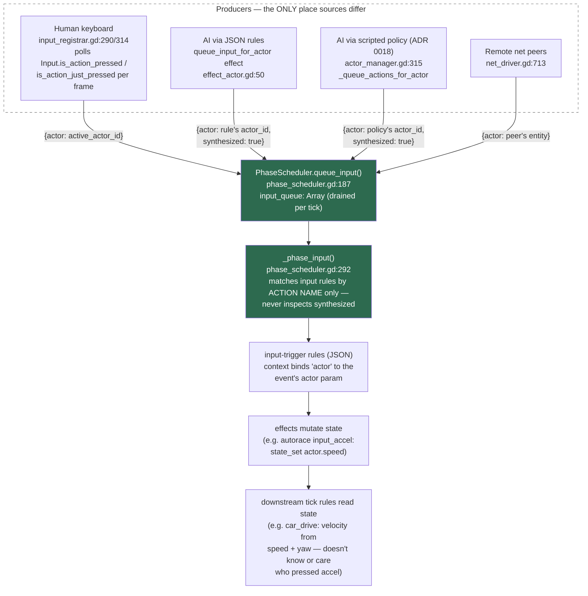

# Input flow — player vs AI (input-parity architecture)

_Last updated: 2026-06-11_

Every input source — keyboard, JSON-rule AI, scripted policy, remote net
peer — converges on the same scheduler queue and is consumed identically.
The ONLY data-level difference is the `synthesized: true` flag the AI
paths attach, and **nothing in the engine reads it** (verified 2026-06-11).
This is why possession (human taking over an AI actor) is a pure-JSON
change: the consumer can't tell who pressed the button.

## Reading the diagram

- **Differentiation lives at the producer call sites, not the consumer.**
  Four producers, one queue, one drain. An AI press and a human press are
  the same event shape by construction.
- **`synthesized: true`** is written by the two AI paths and consumed
  nowhere. Params are flattened into the rule context, so a rule *could*
  filter on it (anti-bot gate, input-source telemetry) — today unused.
- **The `actor` param is what routes control.** Keyboard events carry
  ActorManager's `active_actor_id` (switch via the `switch_actor` effect,
  ADR 0016); AI events carry whatever `actor_id` the rule passed (autorace
  uses `self.state.me`). Four cars can all "press accel" in one tick —
  same action, different actor binding.
- **Possession is pure JSON**: mute the AI's press rules for one entity
  (per-entity state flag in their queries) + `switch_actor` at it. See
  `demo_autorace/world/rules/01_drive.json` for the canonical
  discrete-controller layout (`ai_sense` → `ai_press_*` →
  shared `input_*` handlers → `car_drive` transmission).
