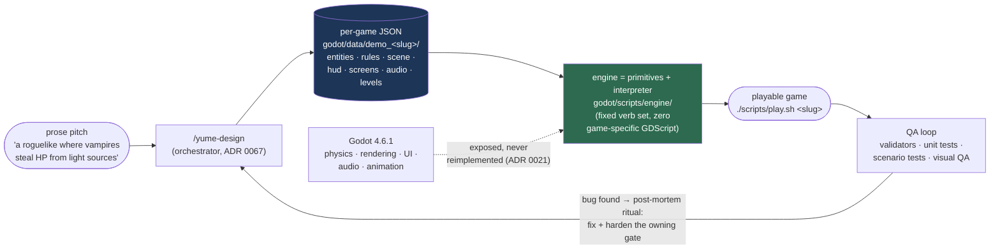
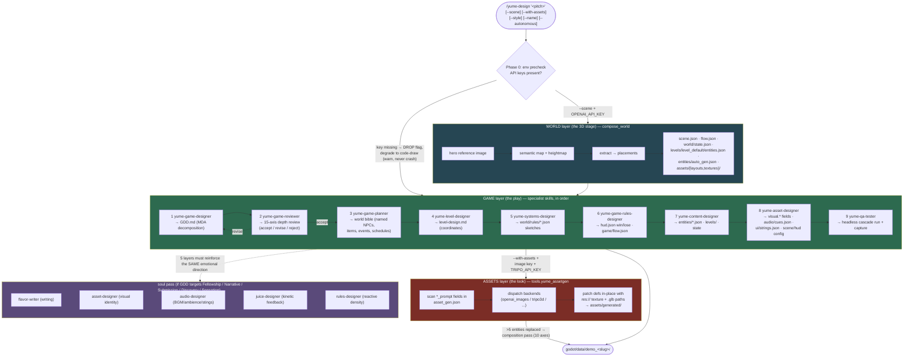
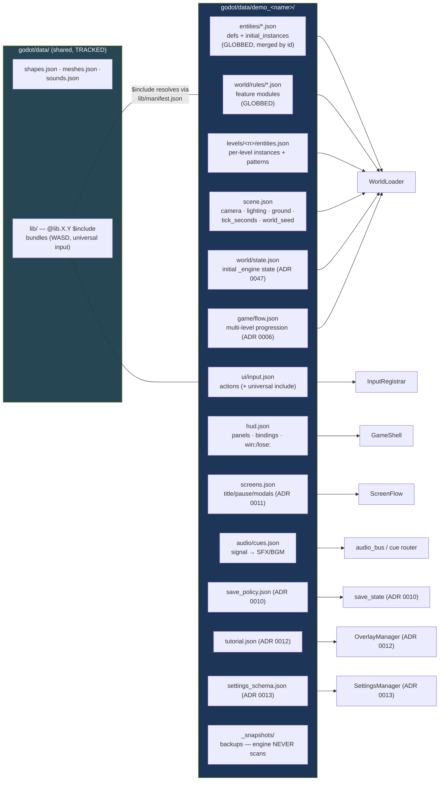
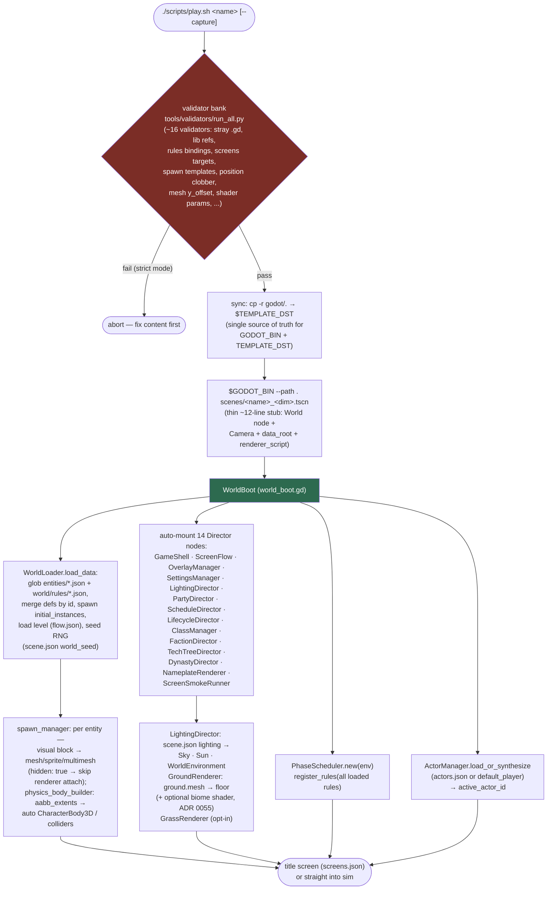
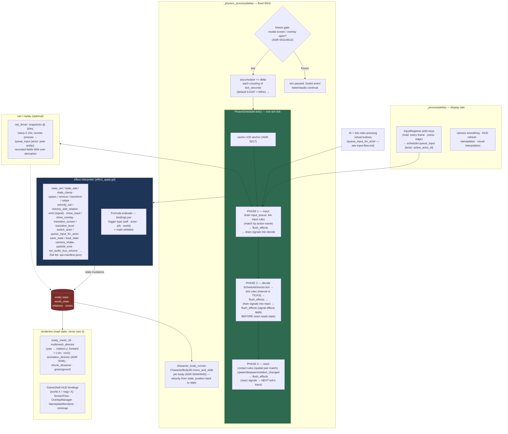
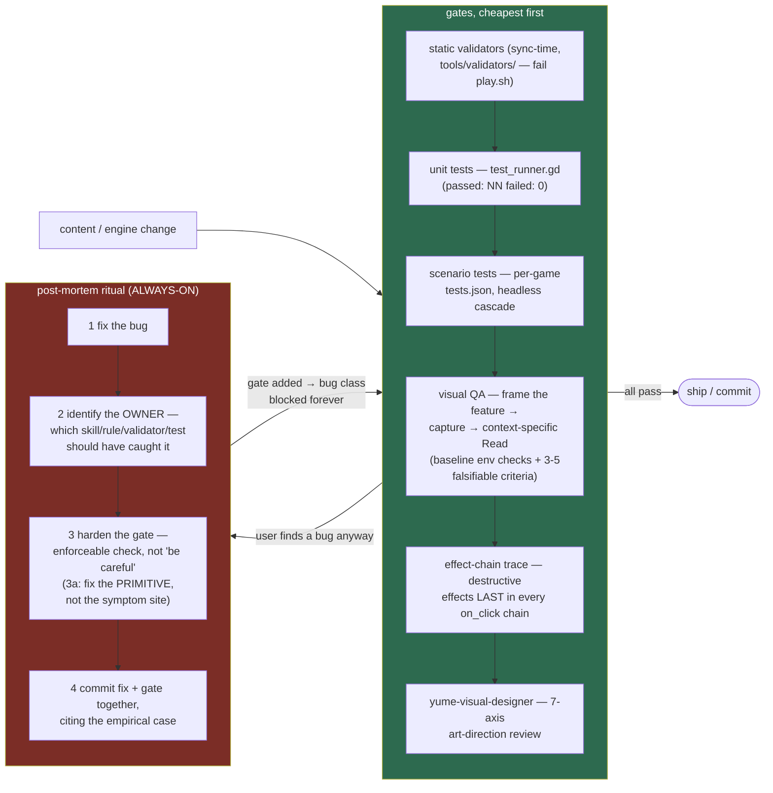

# Yume — the complete flow

_Last updated: 2026-06-11_

Five diagrams, one per altitude: (1) the big picture, (2) the
`/yume-design` generation pipeline, (3) per-game JSON anatomy + ownership,
(4) boot sequence, (5) the runtime loop. Companion doc:
[input-flow.md](input-flow.md) for the player-vs-AI input pipeline.

---

## 1. Big picture — prose to playable

**The contract (Invariant #1 + #8):** all game-specific behavior is JSON;
the engine ships seven primitives (Entity, Tag, Rule, Trigger, Effect,
Query, Relation) plus an interpreter. New behavior = compose existing
verbs in JSON, or propose a new primitive via ADR — never bake game logic
into engine code.

---

## 2. Generation pipeline — `/yume-design` and the three layers

**Disjoint file ownership** is what lets the three layers compose without
clobbering: each layer writes ONLY its own files (see diagram 3). The one
known clobber: never run `/yume-create-scene` on a `/yume-design` game —
its `compose_shell` overwrites the game's player/movement/camera.

---

## 3. Per-game JSON anatomy — who owns what, who reads what

**Layer ownership (ADR 0067):** World layer owns `scene.json`,
`game/flow.json`, `world/state.json`, `levels/level_default/`,
`entities/auto_gen.json`, `assets/{layouts,textures}/`. Game layer owns
`world/rules/*.json`, `entities/<slug>.json`, `hud.json`, `screens.json`,
`audio/`, `ui/`. Assets layer owns `asset_gen.json`, `assets/generated/`,
and in-place `visual.*` patches. Duplicate def ids across globbed files →
alphabetically-last silently wins (gate: `validate_duplicate_defs.py`).

---

## 4. Boot — `play.sh` to first frame

---

## 5. Runtime — the heartbeat (ADR 0068: sim tick on the physics clock)

**Clock discipline:** rules + body integration share the physics clock so
they can never skew under load (ADR 0068). The tick is never a balance
knob — scale a rule's `interval` instead. Display-rate work stays in
`_process`; fixed-rate work (move_and_slide, the accumulator) in
`_physics_process`.

---

## 6. QA + hardening loop — how bugs become gates

The ratchet only goes one way: every user-found bug must leave behind a
machine-enforceable gate (validator > test > reviewer axis > prose rule),
so the same bug class can't recur in a future session, game, or pipeline.
