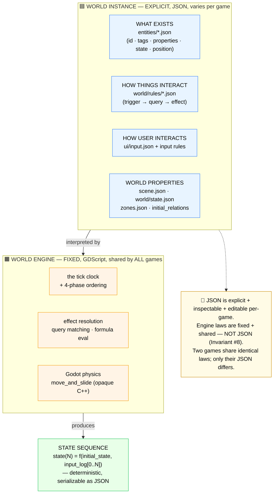
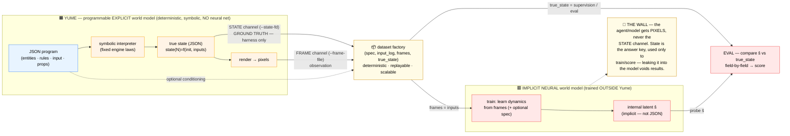
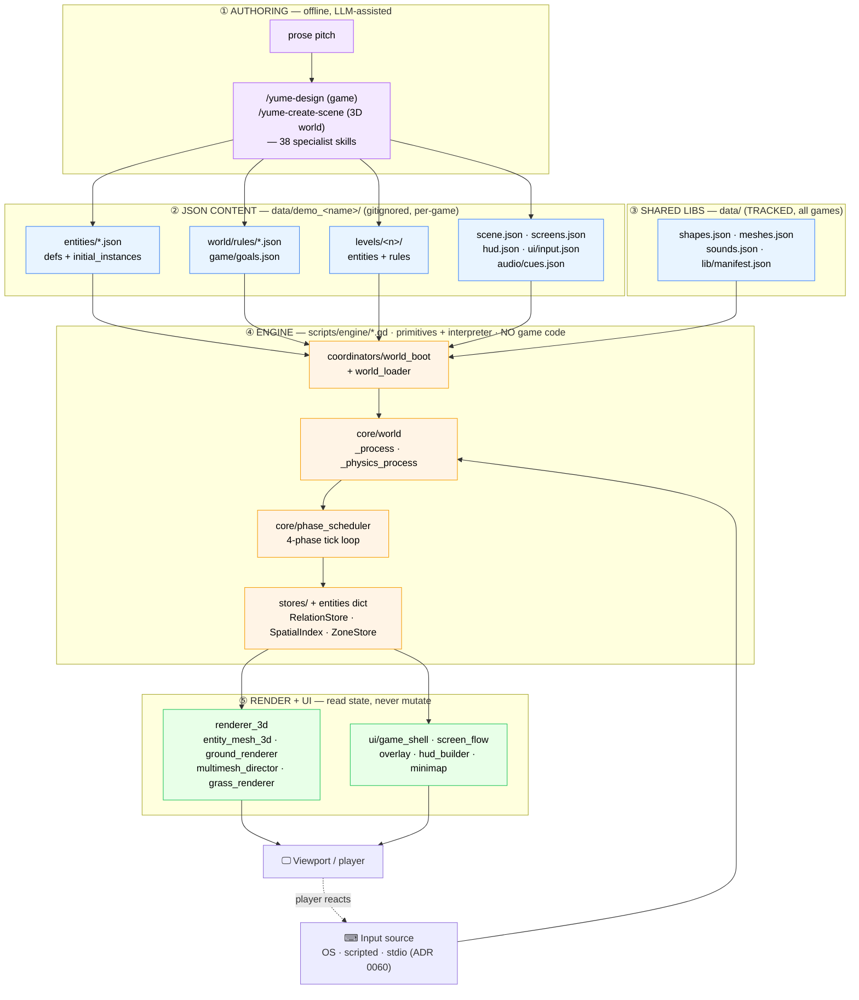
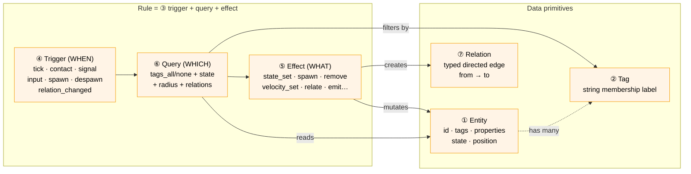
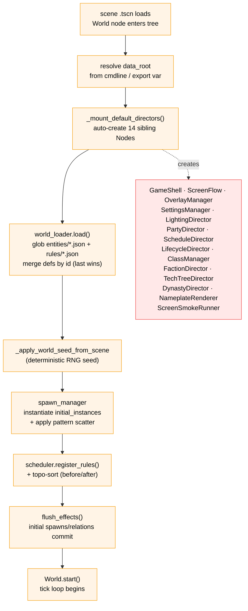
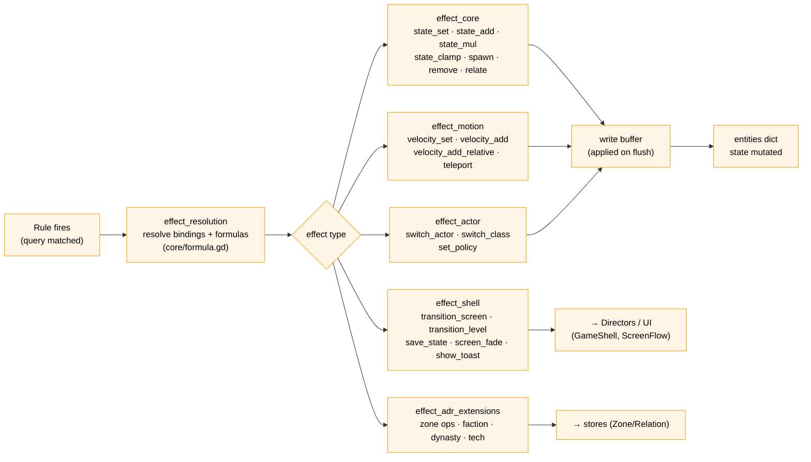
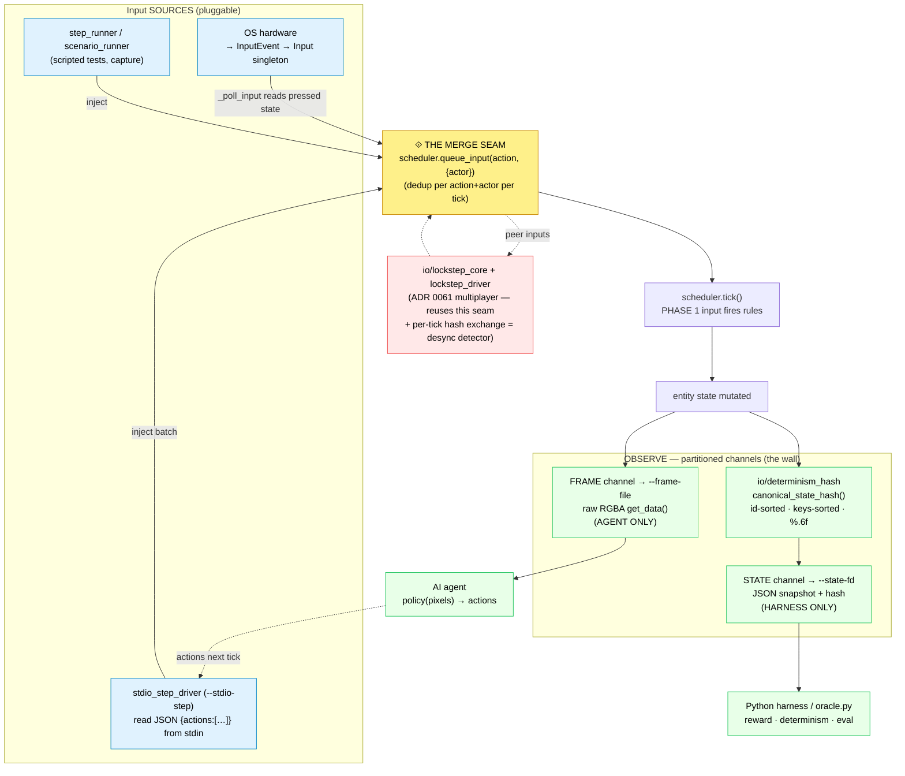
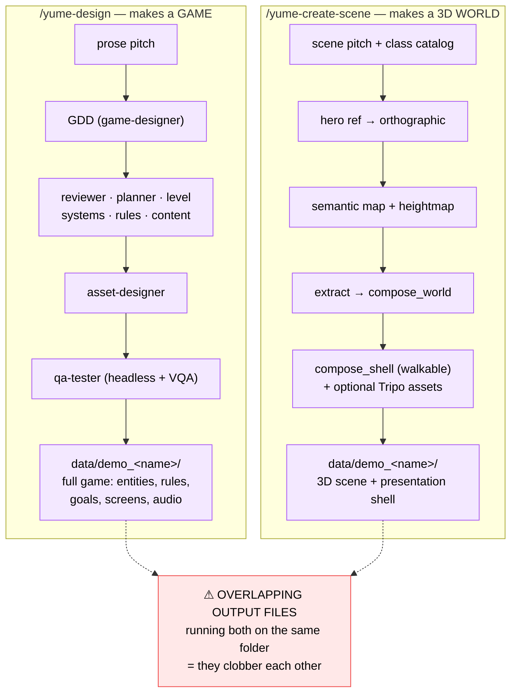
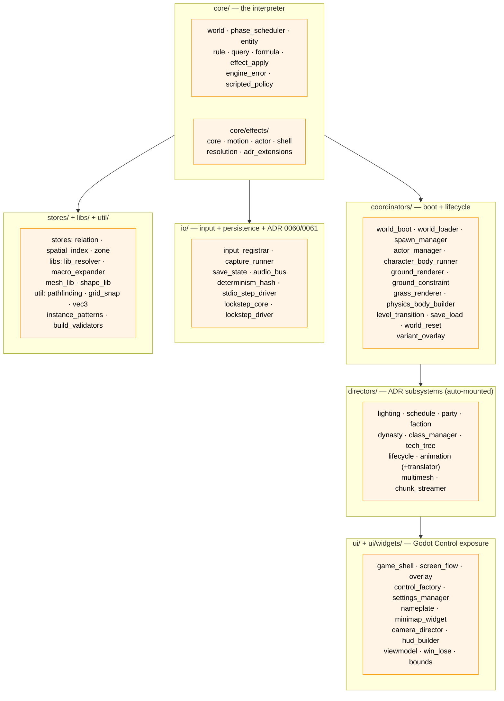

# Yume — detailed architecture (Mermaid)

_Last updated: 2026-05-31_

> **Start with §0** — it's the conceptual frame (Yume as an explicit world
> model: instance JSON vs fixed engine laws, and authored vs learned for
> research). §1-8 are the mechanics that implement it.

Visual reference for the Yume engine, grounded in the actual
`godot/scripts/engine/` source tree (verified 2026-05-31). Render with any
Mermaid viewer (GitHub renders these inline; VS Code "Markdown Preview Mermaid
Support"; or `docs/timeline/index.html` patterns).

The contract is `docs/guideline/30_framework_primitives.md`; this doc is illustration,
not invariant-bearing. Where a diagram cites a file, it's a real path.

---

## 0. Yume as an explicit world model (the conceptual frame)

The whole architecture exists to serve one idea: **the JSON IS an explicit,
declarative world model.** But there are TWO layers, and only one is explicit.
The JSON declares *what the world is*; the engine defines *how it evolves* (the
fixed laws every world shares — Invariant #8, primitives + interpreter).

### 0b. Programmable EXPLICIT world model → trains an implicit NEURAL one

Yume itself contains **no neural component** — it is a *programmable explicit*
world model: JSON program + deterministic symbolic interpreter (the engine).
Its value for ML is as a **data + ground-truth factory**: it deterministically
emits `(JSON spec, input_log, frames, true_state)` tuples that can train and
evaluate a *separate, implicit neural* world model. The neural model lives
OUTSIDE Yume; it never edits the engine. The agent sees only pixels and must
reconstruct the dynamics from observation (the POMDP wall, ADR 0060).

**Key takeaways:**
- **Yume = programmable EXPLICIT model.** JSON is a *program*; the engine is a
  deterministic *symbolic interpreter*. Nothing learns; nothing is approximate.
- **The neural model = IMPLICIT, separate, downstream.** It's trained on Yume's
  emitted data and lives entirely outside the engine. Its "understanding" is a
  learned latent `ŝ`, not JSON. Yume never depends on it.
- The JSON is explicit at the **instance** layer (what exists, what rules, what
  the player can do). The **dynamics** are split: rule *semantics* are explicit
  JSON, but execution semantics (tick order, commit) + physics are fixed engine
  code (Invariant #8) — shared laws, varying instance.
- Yume's rare property: an explicit, *readable* ground-truth state stream — a
  clean answer key for supervising/scoring an implicit model. Most pixel
  environments lock true state in an opaque simulator, so you can only train on
  pixels + reward, never probe against structured truth.

---

## 1. Layered overview — content vs engine vs render

The single most important invariant: **the engine (orange) contains no
game-specific logic.** All game behavior is JSON (blue). Renderers (green)
read engine state and never mutate it.

---

## 2. The seven primitives (ADR 0001)

Everything in a Yume game decomposes into these. No class hierarchy — an
Entity is just a dict; distinctions emerge from Tags + properties + Relations.

---

## 3. Boot sequence — `world_boot.run()`

What happens between launch and the first tick. Most phases no-op when the
relevant ADR's JSON file is absent, so mounting everything is safe.

---

## 4. The tick loop — the engine's heartbeat (`phase_scheduler.tick()`)

**This is the most important diagram.** The 4-phase order + the flushes
between them explain most of the schema-discipline rules in
`.claude/rules/data-demo.md`. Verified against `core/phase_scheduler.gd:tick()`.

```mermaid
flowchart TB
    subgraph FRAME["FRAME RATE — core/world.gd::_process(delta)"]
        POLL["_poll_input()<br/>InputRegistrar reads Input singleton<br/>→ scheduler.queue_input(action, {actor})"]
        FREEZE{"screen_freeze_world<br/>or overlay_freeze?"}
        ACC["accumulate delta<br/>_tick_due() ?"]
        POLL --> FREEZE
        FREEZE -->|frozen| SKIP["skip poll<br/>(modal open)"]
        FREEZE -->|live| ACC
    end

    ACC -->|tick due| TICK

    subgraph TICK["ONE TICK — scheduler.tick() · rules run in JSON definition order (before/after topo-sorted)"]
        direction TB
        LOD["_compute_lod_anchor()<br/>cache active-actor pos once (ADR 0017)<br/>→ all LOD rules read this value"]

        subgraph PH1["PHASE 1 · input — apply what was done"]
            direction TB
            P1["_phase_input()<br/>drain input_queue (deduped action+actor)<br/>fire trigger:input rules · bind self=actor"]
            FL1["flush_effects() ← commit"]
            DR1["drain signals → visible in decide"]
            P1 --> FL1 --> DR1
        end

        subgraph PH2["PHASE 2 · decide — choose what to do"]
            direction TB
            P2["_phase_decide()<br/>fire trigger:tick rules (interval-gated)<br/>+ trigger:signal rules<br/>read state, QUEUE effects (AI, spawn, sync)"]
            FL2["flush_effects() ← commit"]
            DR2["drain signals → react"]
            FL3["flush_effects() ← extra commit<br/>signal-rule effects land BEFORE react reads"]
            P2 --> FL2 --> DR2 --> FL3
        end

        subgraph PH4["PHASE 4 · react — respond to the new reality"]
            direction TB
            P4A["_phase_react()<br/>fire trigger:contact rules<br/>pair-match a,b within radius (once_per_a)"]
            P4B["+ trigger:relation_changed / spawn / despawn<br/>reaction rules read POST-COMMIT state<br/>(positions + flags already updated)"]
            FL4["flush_effects() ← commit"]
            P4C["signals emitted here are NOT drained now —<br/>persist in env.signal_buffer →<br/>surface in NEXT tick's PHASE 1 input"]
            P4A --> P4B --> FL4 --> P4C
        end

        LOD --> PH1 --> PH2 --> PH4
    end

    subgraph PHYS["FRAME RATE — _physics_process / ground_constraint"]
        MOVE["character_body_runner<br/>CharacterBody3D.move_and_slide()<br/>reads state.velocity (Vector2→Vector3)"]
    end

    PH4 --> MUT["mutated entity state<br/>(in stores · single source of truth)"]
    MUT --> MOVE
    MOVE --> POS["position advances<br/>continuously between ticks"]
    POS --> REND["renderers read state<br/>next frame → screen"]
    P4C -.signal_buffer carries across ticks.-> POLL

    note["NOTE: 'commit' is not a 4th rule-loop —<br/>PHASES const = [input, decide, commit, react];<br/>'commit' = the flush_effects() write-buffer drain.<br/>Within a phase ALL rules read the same snapshot,<br/>queue effects, then commit together → no<br/>read-after-write hazards, fully deterministic."]

    classDef f fill:#e0f2fe,stroke:#0284c7,color:#000
    classDef t fill:#fff4e6,stroke:#f59e0b,color:#000
    classDef p fill:#e8ffe8,stroke:#22c55e,color:#000
    classDef r4 fill:#ffe4f0,stroke:#db2777,color:#000
    class POLL,FREEZE,ACC,SKIP f
    class LOD,P1,FL1,DR1,P2,FL2,DR2,FL3 t
    class P4A,P4B,FL4,P4C r4
    class MOVE,POS,REND p
```

**Phase 4 (react) in detail — why it's its own phase:**
- It runs **after** commit, so it reads the world *as it now is*: positions
  advanced, flags set, spawns/removes already applied. A `contact` rule asking
  "is A touching B?" needs the post-commit positions, not the pre-tick ones.
- It fires the *reactive* trigger types: `contact` (pair-matched `a`/`b` in a
  radius, optional `once_per_a`), `relation_changed`, and post-commit
  `spawn`/`despawn` reactions.
- Its emitted signals **do not** drain this tick — they sit in
  `env.signal_buffer` and become input-phase signals **next** tick. That one
  rule is what makes multi-tick chains possible (react → next input → decide …).

**Why the whole ordering matters (each maps to a real `data-demo.md` rule):**
- input **before** decide → "sync-derived fields used as filters must be
  pre-initialized" (a decide-phase sync rule hasn't run at tick 1's input).
- the extra `flush_effects()` before react → a decide/signal rule's flag is
  visible to a react `contact` rule (the sokoban wall-blocks-push fix, cited in
  `phase_scheduler.gd` — without it boxes pushed through walls).
- react signals → **next** tick's input → multi-tick signal chains.

---

## 5. Effect application — `effect_apply.gd` + `core/effects/`

Effects are the only thing that mutates state. They're queued during a phase,
then committed in a `flush_effects()` in JSON definition order. The verb set is
fixed and split across modules by concern.

---

## 6. Input path + ADR 0060 deterministic I/O (as built)

The pluggable-source contract. Per the ADR 0061 implementation note, ADR 0060
unified input at the **poll/queue seam** (`queue_input`), not at synthesized
`InputEvent`s — so every source converges where `_poll_input` would queue.

---

## 7. Two generation pipelines (DON'T mix on one folder)

---

## 8. Engine module map (the actual `scripts/engine/` tree)

---

## Legend

| Color | Meaning |
|---|---|
| 🟦 Blue | JSON content (per-game, gitignored) |
| 🟧 Orange | Engine — primitives + interpreter (no game logic) |
| 🟩 Green | Renderers / observe — read state, never mutate |
| 🟪 Purple | Authoring pipelines (offline) |
| 🟥 Red | Directors / multiplayer / warnings |
| 🟨 Yellow | The input merge seam |

**Source of truth:** `docs/guideline/30_framework_primitives.md` (the contract).
**Verified against:** `godot/scripts/engine/` tree, 2026-05-31.
